# CodiesVibe Deployment Flow Documentation

## Overview

This document describes the complete deployment flow for CodiesVibe, from code push to production deployment on VPS infrastructure. The architecture is fully Docker-based with comprehensive CI/CD pipelines.

## 🔄 End-to-End Flow Diagram

```mermaid
graph TD
    A[Developer Push] --> B{Path Changed?}
    B -->|frontend/| C[Frontend CI/CD]
    B -->|backend/| D[Backend CI/CD]
    B -->|Both| E[Parallel Pipelines]
    
    C --> F[Frontend Tests]
    D --> G[Backend Tests]
    E --> F
    E --> G
    
    F --> H{Tests Pass?}
    G --> I{Tests Pass?}
    
    H -->|❌ Fail| J[❌ Stop Pipeline<br/>Notify Developer]
    I -->|❌ Fail| J
    
    H -->|✅ Pass| K[Security Scan]
    I -->|✅ Pass| L[Security Scan]
    
    K --> M{Security OK?}
    L --> N{Security OK?}
    
    M -->|❌ Fail| O[❌ Block Build<br/>Security Alert]
    N -->|❌ Fail| O
    
    M -->|✅ Pass| P[Build Container]
    N -->|✅ Pass| Q[Build Container]
    
    P --> R{Build Success?}
    Q --> S{Build Success?}
    
    R -->|❌ Fail| T[❌ Build Failed<br/>Check Logs]
    S -->|❌ Fail| T
    
    R -->|✅ Pass| U[Push to GHCR]
    S -->|✅ Pass| V[Push to GHCR]
    
    U --> W{Registry Push OK?}
    V --> X{Registry Push OK?}
    
    W -->|❌ Fail| Y[❌ Registry Error<br/>Retry Logic]
    X -->|❌ Fail| Y
    
    W -->|✅ Pass| Z[✅ Build Complete]
    X -->|✅ Pass| Z
    
    Z --> AA{Deploy Trigger}
    AA -->|Manual| BB[Manual Deploy]
    AA -->|Auto| CC[Auto Deploy]
    
    BB --> DD[SSH to VPS]
    CC --> DD
    
    DD --> EE{SSH Success?}
    EE -->|❌ Fail| FF[❌ Connection Failed<br/>Check VPS Status]
    
    EE -->|✅ Pass| GG[Pull Latest Images]
    GG --> HH{Image Pull OK?}
    HH -->|❌ Fail| II[❌ Pull Failed<br/>Check Registry Access]
    
    HH -->|✅ Pass| JJ[Update Compose Files]
    JJ --> KK[Stop Old Containers]
    KK --> LL[Start New Containers]
    
    LL --> MM{Health Check}
    MM -->|❌ Fail| NN[🔄 Rollback<br/>Restore Previous]
    MM -->|✅ Pass| OO[✅ Deployment Success]
    
    NN --> PP[Notify Failure]
    OO --> QQ[Notify Success]
    
    style J fill:#ffebee
    style O fill:#ffebee
    style T fill:#ffebee
    style Y fill:#ffebee
    style FF fill:#ffebee
    style II fill:#ffebee
    style NN fill:#fff3e0
    style PP fill:#ffebee
    style OO fill:#e8f5e8
    style QQ fill:#e8f5e8
```



### 📊 Flow Timing Expectations

| Phase | Expected Duration | Timeout | Notes |
|-------|------------------|---------|-------|
| **Tests** | 2-5 minutes | 10 minutes | Jest, ESLint, TypeScript |
| **Security Scan** | 1-3 minutes | 5 minutes | Trivy, npm audit, license check |
| **Container Build** | 3-8 minutes | 15 minutes | Multi-platform (AMD64/ARM64) |
| **Registry Push** | 1-2 minutes | 5 minutes | GHCR upload with retries |
| **Performance Testing** | 2-4 minutes | 8 minutes | Lighthouse, API load testing |
| **VPS Deployment** | 2-4 minutes | 10 minutes | SSH, pull, health checks |
| **Health Validation** | 30-90 seconds | 3 minutes | Comprehensive endpoint testing |
| **Total Frontend Pipeline** | 8-15 minutes | 30 minutes | Including performance tests |
| **Total Backend Pipeline** | 10-18 minutes | 35 minutes | Including API testing |
| **Deployment Workflow** | 5-10 minutes | 20 minutes | VPS deployment only |

## 🔗 Service Dependencies & Startup Order

### Dependency Hierarchy


### Startup Sequence

#### Phase 1: Infrastructure (0-30 seconds)
```bash
# Required first - no dependencies
1. Docker Network Creation
   └── codiesvibe-network
2. Volume Initialization
   └── mongodb-data, redis-data, logs
```

#### Phase 2: Data Layer (30-60 seconds)
```bash
# Start databases first
3. MongoDB Container
   ├── Health Check: db.runCommand("ping")
   ├── Initialization: mongo-init.js
   └── Ready Signal: Port 27017 accepting connections

4. Redis Container
   ├── Health Check: redis-cli ping
   ├── Configuration: redis.conf
   └── Ready Signal: Port 6379 accepting connections
```

#### Phase 3: Backend Services (60-120 seconds)
```bash
# Wait for databases before starting
5. Backend API Container
   ├── Dependencies: MongoDB + Redis
   ├── Health Check: GET /health
   ├── Database Migration: Auto-run on startup
   └── Ready Signal: Port 4000 serving requests
```

#### Phase 4: Frontend Services (90-150 seconds)
```bash
# Can start in parallel with backend
6. Frontend Container
   ├── Dependencies: None (static assets)
   ├── Build Assets: Pre-built in container
   ├── Health Check: GET /
   └── Ready Signal: Port 3000 serving content
```

#### Phase 5: Proxy Layer (120-180 seconds)
```bash
# Wait for backend/frontend to be ready
7. Nginx Container
   ├── Dependencies: Backend + Frontend
   ├── Configuration: nginx.conf
   ├── SSL Certificates: Let's Encrypt/Cloudflare
   ├── Health Check: GET /nginx-health
   └── Ready Signal: Port 80/443 proxying requests

8. Cloudflare Tunnel (Optional)
   ├── Dependencies: Nginx
   ├── Authentication: Cloudflare token
   ├── Tunnel Configuration: config.yml
   └── Ready Signal: Tunnel established
```

#### Phase 6: Monitoring Layer (150-240 seconds)
```bash
# Start monitoring after core services
9. Prometheus Container
   ├── Dependencies: All core services
   ├── Configuration: prometheus.yml
   ├── Target Discovery: Service endpoints
   └── Ready Signal: Port 9090 collecting metrics

10. Grafana Container
    ├── Dependencies: Prometheus
    ├── Datasource: Prometheus connection
    ├── Dashboard Import: Auto-provisioning
    └── Ready Signal: Port 3000 (internal)

11. Loki Container
    ├── Dependencies: None
    ├── Configuration: loki-config.yml
    └── Ready Signal: Port 3100 accepting logs

12. AlertManager Container
    ├── Dependencies: Prometheus
    ├── Configuration: alertmanager.yml
    └── Ready Signal: Port 9093 handling alerts
```

### Docker Compose Dependency Configuration

```yaml
# Example dependency configuration
version: '3.8'
services:
  mongodb:
    # No dependencies - starts first
    
  redis:
    # No dependencies - starts first
    
  backend:
    depends_on:
      mongodb:
        condition: service_healthy
      redis:
        condition: service_healthy
    healthcheck:
      test: ["CMD", "curl", "-f", "http://localhost:4000/health"]
      interval: 30s
      timeout: 10s
      retries: 3
      start_period: 60s
      
  frontend:
    # No runtime dependencies
    healthcheck:
      test: ["CMD", "curl", "-f", "http://localhost:3000"]
      interval: 30s
      timeout: 10s
      retries: 3
      
  nginx:
    depends_on:
      backend:
        condition: service_healthy
      frontend:
        condition: service_healthy
        
  prometheus:
    depends_on:
      - backend
      - frontend
      - nginx
      
  grafana:
    depends_on:
      prometheus:
        condition: service_started
```

### Critical Path Analysis

#### Minimum Viable Service (MVS)
**Required for basic functionality**:
1. MongoDB (data persistence)
2. Backend API (business logic)
3. Frontend (user interface)
4. Nginx (request routing)

**Total MVS Startup Time**: ~2-3 minutes

#### Full Stack Deployment
**Complete system with monitoring**:
- All MVS components +
- Redis (caching/sessions)
- Prometheus (metrics)
- Grafana (visualization)
- Loki (logging)
- AlertManager (alerting)

**Total Full Stack Time**: ~4-5 minutes

### Dependency Failure Handling

#### Database Failures
```bash
# MongoDB failure impact
MongoDB Down → Backend Fails → API Unavailable → Frontend Shows Errors

# Redis failure impact  
Redis Down → Backend Degraded → Sessions Lost → Caching Disabled
```

#### Service Recovery Order
```bash
# Recovery sequence
1. Fix Database Issues
2. Restart Backend (auto-reconnects)
3. Verify Frontend Connectivity
4. Restart Nginx (if needed)
5. Restart Monitoring (last priority)
```

#### Graceful Degradation
- **Backend**: Continues without Redis (no caching)
- **Frontend**: Shows error states for API failures
- **Monitoring**: Core services continue without metrics
- **Nginx**: Serves static content even if backend fails

### Health Check Dependencies

#### Cascading Health Checks
```bash
# Health check chain
Database Health → Backend Health → Nginx Health → External Health

# Individual timeouts
- Database: 10s timeout
- Backend: 30s timeout (includes DB check)
- Nginx: 10s timeout
- Full Stack: 60s timeout
```

#### Health Check Endpoints
```bash
# Service health endpoints
GET /health/mongodb     # Database connectivity
GET /health/redis       # Cache connectivity  
GET /health/backend     # API functionality
GET /health/frontend    # Static asset serving
GET /health/nginx       # Proxy functionality
GET /health/full        # Complete system check
```

## Architecture Components

### 🏗️ Infrastructure Stack
- **MongoDB**: External database (not containerized)
- **Redis**: Caching and session storage
- **Prometheus**: Metrics collection
- **Grafana**: Monitoring dashboards
- **Loki**: Log aggregation
- **AlertManager**: Alert management

### 📱 Application Stack
- **Frontend**: React + Vite application served by Nginx
- **Backend**: NestJS API server
- **Nginx**: Reverse proxy and static file server

## Deployment Environments

### 1. Development Environment
```bash
# Start infrastructure
docker-compose -f docker-compose.infra.yml up -d

# Start development services with hot reload
docker-compose -f docker-compose.dev.yml up -d
```

**Features:**
- Hot reload for both frontend and backend
- Debug ports exposed (9229 for Node.js)
- Volume mounts for live code changes
- Relaxed security settings

### 2. Production Environment
```bash
# Start infrastructure
docker-compose -f docker-compose.infra.yml up -d

# Start production services
docker-compose -f docker-compose.production.yml up -d
```

**Features:**
- Pre-built images from GitHub Container Registry
- Nginx reverse proxy with SSL support
- Optimized resource limits
- Enhanced security configurations

### 3. Cloudflare Tunnel Deployment
```bash
# Start infrastructure
docker-compose -f docker-compose.infra.yml up -d

# Start with Cloudflare tunnel (no port exposure)
docker-compose -f docker-compose.cloudflare.yml up -d
```

**Features:**
- Zero port exposure to internet
- Automatic SSL termination via Cloudflare
- DDoS protection and CDN benefits
- Secure tunnel-based access

## CI/CD Pipeline Flow

### Pipeline Architecture Overview

Our CI/CD system consists of **5 specialized workflows** working together:

| Workflow | Trigger | Purpose | Duration |
|----------|---------|---------|----------|
| **Frontend CI/CD** | Frontend changes on `main`/`staging` | Frontend testing, building, performance | 8-15 min |
| **Backend CI/CD** | Backend changes on `main`/`staging` | Backend testing, API testing, security | 10-18 min |
| **Deployment** | Manual dispatch | Unified deployment to staging/production | 5-10 min |
| **Monitoring** | Every 15 minutes | Continuous health monitoring | 2-3 min |
| **Dependency Updates** | Weekly (Sunday) | Automated dependency management | 5-8 min |

### Stage 1: Code Push Triggers


**Pipeline Trigger Configuration:**
```yaml
on:
  push:
    branches: [main, staging]  # Only protected branches
    paths: ['frontend/**', 'backend/**']
  pull_request:
    branches: [main, staging]  # PRs to protected branches
  workflow_dispatch:  # Manual triggers
```

**Branch Strategy:**
- ✅ **Protected Branches** (`main`, `staging`): Full CI/CD pipeline
- ✅ **Pull Requests**: Testing and validation only
- ❌ **Feature Branches**: No automatic pipeline execution
- ✅ **Tagged Releases**: Full pipeline with deployment

### Stage 2: Frontend Pipeline
1. **Testing Phase**
   - ESLint and TypeScript checking
   - Unit tests with Jest
   - Coverage reporting
   - Performance audits

2. **Security Phase**
   - npm audit for vulnerabilities
   - Dependency security scanning
   - License compliance checks

3. **Build Phase**
   - Multi-platform Docker build (AMD64/ARM64)
   - Production optimization
   - Image tagging and metadata

4. **Registry Phase**
   - Push to GitHub Container Registry
   - Automated cleanup of old images
   - OCI compliance and SBOM generation

5. **Performance Testing** (main/develop branches only)
   - Lighthouse performance audits
   - Bundle size analysis
   - Response time validation

## Container Build Phase (Detailed)

### Frontend Container Build
```yaml
# Multi-platform Docker build with Buildx
- name: Build and push Frontend
  uses: docker/build-push-action@v5
  with:
    context: .
    file: ./Dockerfile.frontend
    target: production
    platforms: linux/amd64,linux/arm64
    cache-from: type=gha
    cache-to: type=gha,mode=max
```

**Build Features:**
- **Multi-platform Support**: AMD64 and ARM64 architectures
- **Build Cache**: GitHub Actions cache for faster builds
- **Multi-stage Dockerfile**: Optimized production builds
- **OCI Compliance**: Standard container image format
- **Metadata Injection**: Build date, Git commit, version info

**Image Tagging Strategy:**
- `latest` - Latest main branch build
- `stable` - Production-ready main branch
- `sha-{short-sha}` - Specific commit builds
- `{branch}-{sha}` - Branch-specific builds
- `{date}-{sha}` - Timestamped builds
- Semantic versioning support

### Backend Container Build
```yaml
# Similar multi-platform build with additional security scanning
- name: Build and push Backend
  uses: docker/build-push-action@v5
  with:
    context: .
    file: ./Dockerfile.backend
    target: production
    platforms: linux/amd64,linux/arm64
```

**Security Integration:**
- **Trivy Scanning**: Vulnerability assessment on built images
- **SBOM Generation**: Software Bill of Materials
- **License Compliance**: Automated license checking
- **Critical/High Severity Blocking**: Fails build on critical vulnerabilities

### Container Registry Management
- **GitHub Container Registry (GHCR)**: `ghcr.io/username/codiesvibe-frontend`
- **Automated Cleanup**: Old images removed based on retention policy
- **Image Signing**: Optional container signing for production
- **Pull Statistics**: Usage metrics and download tracking

### Stage 3: Backend Pipeline
1. **Testing Phase**
   - ESLint and TypeScript checking
   - Unit and integration tests
   - Database connectivity tests (MongoDB/Redis)
   - API endpoint validation

2. **Security Phase**
   - Trivy container scanning
   - SBOM generation for compliance
   - Vulnerability assessment

3. **Build Phase**
   - Multi-platform Docker build
   - Health check integration
   - Performance optimization

4. **Registry Phase**
   - Push to GitHub Container Registry
   - Version tagging and metadata
   - Automated image cleanup

5. **API Testing** (main/develop branches only)
   - Load testing with Artillery
   - Database performance validation
   - API endpoint comprehensive testing

### Stage 4: Deployment Pipeline
1. **Validation Phase**
   - Input parameter validation
   - Image availability verification
   - Environment configuration check

2. **Deployment Phase**
   - SSH connection to target VPS
   - Infrastructure stack verification
   - Application stack deployment
   - Health check validation

3. **Verification Phase**
   - Service availability testing
   - Database connectivity validation
   - Monitoring integration check

### Stage 5: Additional Automated Workflows

#### Health Monitoring Pipeline (`monitoring.yml`)
```yaml
# Scheduled health monitoring
schedule:
  - cron: '*/15 * * * *'  # Every 15 minutes

Features:
- Continuous endpoint health checks
- SSL certificate expiration monitoring
- Response time validation
- Cloudflare integration verification
- Multi-environment health validation
```

#### Dependency Management Pipeline (`dependency-updates.yml`)
```yaml
# Weekly dependency updates
schedule:
  - cron: '0 2 * * 0'  # Sunday 2 AM UTC

Features:
- Automated dependency updates
- Security vulnerability patches
- License compliance verification
- Docker base image updates
- Automated PR creation for updates
```

#### Unified Deployment Pipeline (`deployment.yml`)
```yaml
# Manual deployment workflow
workflow_dispatch:
  inputs:
    service: [frontend, backend, both]
    environment: [staging, production]
    
Features:
- Service-specific deployments
- Environment-aware deployment
- SSH-based VPS deployment
- Health check validation
- Automatic rollback on failure
```

## VPS Deployment Phase (Detailed)

### Deployment Architecture on VPS
```bash
# VPS Directory Structure
~/codiesvibe/
├── docker-compose.production.yml    # Production services
├── docker-compose.infra.yml         # Infrastructure services
├── nginx.conf                       # Reverse proxy config
├── .env.production                  # Environment variables
└── backups/                         # Configuration backups
```

### SSH-Based Deployment Process
```bash
# 1. File Transfer Phase
scp docker-compose.production.yml user@vps:~/codiesvibe/
scp nginx.conf user@vps:~/codiesvibe/

# 2. Remote Execution Phase
ssh user@vps << 'EOF'
  cd ~/codiesvibe
  
  # Backup current configuration
  docker-compose -f docker-compose.production.yml config > backup-$(date +%Y%m%d-%H%M%S).yml
  
  # Set deployment variables
  export VERSION=${GITHUB_SHA}
  export FRONTEND_IMAGE=ghcr.io/username/codiesvibe-frontend:${VERSION}
  export BACKEND_IMAGE=ghcr.io/username/codiesvibe-backend:${VERSION}
  
  # Infrastructure startup
  docker-compose -f docker-compose.infra.yml up -d
  
  # Application deployment
  docker-compose -f docker-compose.production.yml pull
  docker-compose -f docker-compose.production.yml up -d --force-recreate
EOF
```

### Container Orchestration on VPS
**Infrastructure Stack (Always First):**
```yaml
# docker-compose.infra.yml
services:
  mongodb:
    image: mongo:7
    ports: ["27017:27017"]
  
  redis:
    image: redis:7-alpine
    ports: ["6379:6379"]
  
  prometheus:
    image: prom/prometheus
    ports: ["9090:9090"]
```

**Application Stack (After Infrastructure):**
```yaml
# docker-compose.production.yml
services:
  frontend:
    image: ${FRONTEND_IMAGE}
    depends_on: [nginx]
  
  backend:
    image: ${BACKEND_IMAGE}
    depends_on: [mongodb, redis]
  
  nginx:
    image: nginx:alpine
    ports: ["80:80", "443:443"]
```

### Deployment Strategies

#### 1. Rolling Deployment (Default)
```bash
# Zero-downtime deployment
docker-compose up -d --force-recreate --no-deps frontend
docker-compose up -d --force-recreate --no-deps backend
```

#### 2. Blue-Green Deployment
```bash
# Deploy to staging first, then switch
docker-compose -f docker-compose.staging.yml up -d
# Health checks pass
docker-compose -f docker-compose.production.yml down
docker-compose -f docker-compose.staging.yml up -d
```

#### 3. Service-Specific Deployment
```bash
# Deploy only frontend
docker-compose up -d --force-recreate frontend nginx

# Deploy only backend
docker-compose up -d --force-recreate backend
```

### Health Check & Rollback System
```bash
# Automated health verification
timeout 300 bash -c 'until docker-compose ps | grep -q "healthy"; do 
  echo "Waiting for services..."; 
  sleep 5; 
done'

# Rollback on failure
if ! curl -f http://localhost/health; then
  echo "Health check failed, rolling back..."
  docker-compose -f backup-compose-*.yml up -d
  exit 1
fi
```

### Container Lifecycle Management
- **Image Pulling**: Latest images from GHCR before deployment
- **Container Recreation**: Force recreate ensures latest image usage
- **Volume Persistence**: Data volumes maintained across deployments
- **Network Isolation**: Services communicate via Docker networks
- **Resource Limits**: CPU/memory constraints per service
- **Restart Policies**: Automatic restart on failure

### Monitoring Integration
- **Container Metrics**: Exported to Prometheus
- **Log Aggregation**: Centralized logging via Loki
- **Alert Integration**: Failure notifications via AlertManager
- **Performance Tracking**: Response time and error rate monitoring

## Network Architecture

### Docker Network Configuration
```yaml
networks:
  codiesvibe-network:
    external: true
    name: codiesvibe-network
```

All services communicate through the shared `codiesvibe-network` Docker network, enabling:
- Service discovery by container name
- Isolated network communication
- Load balancing capabilities
- Security through network segmentation

### Port Allocation Strategy
- **Frontend Dev**: 3000 (HTTP), 5173 (HMR WebSocket)
- **Backend**: 4000 (API), 9229 (Debug)
- **Nginx**: 80 (HTTP), 443 (HTTPS)
- **Infrastructure**: Offset ports to avoid conflicts
  - MongoDB: 27017
  - Redis: 6379
  - Prometheus: 9090
  - Grafana: 3000 (internal)

## Security Considerations

### Container Security
- Read-only root filesystems where possible
- Dropped capabilities (CAP_DROP: ALL)
- Non-root user execution
- Resource limits and quotas
- Security scanning in CI/CD

### Network Security
- No direct port exposure in Cloudflare mode
- Internal service communication only
- SSL termination at edge (Cloudflare/Nginx)
- CORS configuration for cross-origin requests

### Secrets Management
- Environment variable injection
- Docker secrets support
- External secret management integration
- Rotation policies for production

## Monitoring and Observability

### Metrics Collection
- **Prometheus**: Application and infrastructure metrics
- **Node Exporter**: System-level metrics
- **Custom Exporters**: Application-specific metrics

### Visualization
- **Grafana Dashboards**: Pre-configured dashboards
- **SLI/SLO Monitoring**: Service level indicators
- **Real-time Alerts**: Critical threshold monitoring

### Logging
- **Loki**: Centralized log aggregation
- **Promtail**: Log shipping and parsing
- **Structured Logging**: JSON format for analysis

### Alerting
- **AlertManager**: Alert routing and management
- **Multiple Channels**: Email, Slack, PagerDuty
- **Escalation Policies**: Tiered alert handling

## 🚨 Failure Scenarios & Recovery

### Test Phase Failures

#### Frontend Test Failures
**Scenario**: Unit tests, integration tests, or linting fails
```bash
# Common failure patterns
❌ Test suite failed: 3 of 45 tests failed
❌ ESLint errors: 12 violations found
❌ TypeScript compilation errors
```

**Recovery Actions**:
1. **Automatic**: Pipeline stops immediately
2. **Notification**: Developer receives GitHub notification + email
3. **Manual Fix**: Developer fixes issues and pushes again
4. **No Build**: Container build phase never starts

#### Backend Test Failures
**Scenario**: API tests, database tests, or validation fails
```bash
# Common failure patterns
❌ E2E tests failed: Database connection timeout
❌ Jest tests failed: 5 of 32 test suites failed
❌ Health check endpoint not responding
```

**Recovery Actions**:
1. **Automatic**: Pipeline halts, no container build
2. **Logs**: Detailed test output in GitHub Actions
3. **Database**: Test database cleanup and retry
4. **Dependencies**: Check service dependencies

### Security Scan Failures

#### Vulnerability Detection
**Scenario**: Trivy security scan finds critical vulnerabilities
```bash
# Critical security issues
❌ HIGH: 3 vulnerabilities found in dependencies
❌ CRITICAL: 1 vulnerability in base image
❌ License compliance violation detected
```

**Recovery Actions**:
1. **Block Build**: Container build prevented automatically
2. **Security Alert**: Security team notified immediately
3. **Dependency Update**: Update vulnerable packages
4. **Base Image**: Switch to patched base image
5. **Override**: Manual security review for false positives

### Container Build Failures

#### Docker Build Issues
**Scenario**: Container build fails during image creation
```bash
# Build failure patterns
❌ Docker build failed: Step 8/12 failed
❌ npm install failed: Network timeout
❌ Multi-platform build failed: ARM64 compilation error
```

**Recovery Actions**:
1. **Retry Logic**: Automatic retry up to 3 times
2. **Platform Fallback**: Build for AMD64 only if ARM64 fails
3. **Cache Clear**: Clear Docker build cache and retry
4. **Dependency Check**: Verify package availability
5. **Manual Investigation**: Check build logs for root cause

### Registry Push Failures

#### GHCR Upload Issues
**Scenario**: Built image fails to push to GitHub Container Registry
```bash
# Registry failure patterns
❌ Push failed: Authentication error
❌ Registry timeout: Network connectivity issues
❌ Storage quota exceeded
```

**Recovery Actions**:
1. **Authentication**: Refresh GitHub token
2. **Retry**: Exponential backoff retry (3 attempts)
3. **Cleanup**: Remove old images to free space
4. **Alternative Registry**: Fallback to Docker Hub (if configured)
5. **Manual Push**: Developer manual intervention

### Deployment Failures

#### SSH Connection Issues
**Scenario**: Cannot connect to VPS for deployment
```bash
# SSH failure patterns
❌ SSH connection failed: Host unreachable
❌ Authentication failed: Key rejected
❌ Connection timeout after 30 seconds
```

**Recovery Actions**:
1. **VPS Health Check**: Verify server status
2. **Key Rotation**: Update SSH keys if needed
3. **Network Check**: Verify firewall and network connectivity
4. **Fallback Server**: Deploy to backup VPS (if available)
5. **Manual Deployment**: SSH manually and deploy

#### Image Pull Failures
**Scenario**: VPS cannot pull latest images from registry
```bash
# Image pull failure patterns
❌ Pull failed: Image not found
❌ Registry authentication failed
❌ Network timeout during pull
```

**Recovery Actions**:
1. **Registry Auth**: Verify GHCR access token on VPS
2. **Image Verification**: Confirm image exists in registry
3. **Network Check**: Test registry connectivity
4. **Local Build**: Build image directly on VPS (emergency)
5. **Previous Version**: Rollback to last known good image

#### Container Startup Failures
**Scenario**: New containers fail to start or pass health checks
```bash
# Container startup failures
❌ Container exited with code 1
❌ Health check failed: HTTP 500 error
❌ Database connection failed
❌ Port binding failed: Address already in use
```

**Recovery Actions**:
1. **Automatic Rollback**: Restore previous container version
2. **Health Check**: Extended timeout for slow startup
3. **Dependency Check**: Verify database/Redis availability
4. **Port Cleanup**: Kill processes using required ports
5. **Manual Investigation**: Check container logs

### Service Dependency Failures

#### Database Connection Issues
**Scenario**: Application cannot connect to MongoDB/Redis
```bash
# Database failure patterns
❌ MongoDB connection timeout
❌ Redis authentication failed
❌ Database migration failed
```

**Recovery Actions**:
1. **Service Restart**: Restart database containers
2. **Connection Pool**: Reset connection pools
3. **Network Check**: Verify Docker network connectivity
4. **Backup Restore**: Restore from latest backup if corrupted
5. **Manual Recovery**: Direct database intervention

#### External Service Failures
**Scenario**: Third-party services (Cloudflare, monitoring) fail
```bash
# External service failures
❌ Cloudflare Tunnel disconnected
❌ Monitoring endpoints unreachable
❌ Email notification service down
```

**Recovery Actions**:
1. **Service Status**: Check third-party status pages
2. **Fallback Routes**: Use alternative access methods
3. **Monitoring Bypass**: Continue deployment without monitoring
4. **Manual Notification**: Send alerts manually
5. **Service Recovery**: Wait for service restoration

### 🔄 Automated Recovery Mechanisms

#### Pipeline Level
- **Retry Logic**: 3 attempts with exponential backoff
- **Parallel Builds**: Independent frontend/backend pipelines
- **Timeout Handling**: Configurable timeouts per stage
- **Notification System**: Multi-channel failure alerts

#### Deployment Level
- **Health Check Validation**: 2-minute timeout with retries
- **Automatic Rollback**: Previous version restoration
- **Zero-Downtime**: Blue-green deployment strategy
- **Monitoring Integration**: Real-time failure detection

#### Infrastructure Level
- **Container Restart**: Automatic restart on failure
- **Resource Scaling**: Dynamic resource allocation
- **Network Recovery**: Automatic network healing
- **Data Persistence**: Volume backup and recovery

## Troubleshooting Guide

### Common Issues

#### 1. Container Startup Failures
```bash
# Check container logs
docker-compose logs [service-name]

# Verify network connectivity
docker network ls
docker network inspect codiesvibe-network
```

#### 2. Database Connection Issues
```bash
# Test MongoDB connectivity
docker exec -it mongodb mongosh --eval "db.adminCommand('ping')"

# Check Redis connectivity
docker exec -it redis redis-cli ping
```

#### 3. CI/CD Pipeline Failures
- Verify GitHub secrets configuration
- Check image registry permissions
- Validate SSH key access to VPS
- Review workflow logs in GitHub Actions

#### 4. Cloudflare Tunnel Issues
```bash
# Check tunnel status
docker-compose -f docker-compose.cloudflare.yml logs cloudflared

# Verify tunnel token
echo $CLOUDFLARE_TUNNEL_TOKEN
```

### Health Check Endpoints
- **Frontend**: `GET /health`
- **Backend**: `GET /api/health`
- **Infrastructure**: Individual service health checks

## Best Practices

### Development
1. Always start infrastructure stack first
2. Use volume mounts for hot reload
3. Enable debug ports for troubleshooting
4. Monitor resource usage during development

### Production
1. Use pre-built images from registry
2. Implement proper secret management
3. Configure monitoring and alerting
4. Regular security updates and patches

### CI/CD
1. Separate pipelines for frontend/backend
2. Comprehensive testing before deployment
3. Security scanning at every stage
4. Automated rollback on failure

## Quick Reference Commands

### Development Setup
```bash
# Full development environment
docker-compose -f docker-compose.infra.yml up -d
docker-compose -f docker-compose.dev.yml up -d

# Check all services
docker-compose -f docker-compose.dev.yml ps
```

### Production Deployment
```bash
# Production environment
docker-compose -f docker-compose.infra.yml up -d
docker-compose -f docker-compose.production.yml up -d

# Health check
curl http://localhost/health
curl http://localhost/api/health
```

### Monitoring Access
- **Grafana**: http://localhost:3002
- **Prometheus**: http://localhost:9091
- **AlertManager**: http://localhost:9093

### GitHub Actions Workflows
```bash
# Manual deployment workflow
# Go to: GitHub Repository > Actions > Deployment > Run workflow
# Options: service (frontend/backend/both), environment (staging/production)

# View pipeline status
# Go to: GitHub Repository > Actions > All workflows

# Check workflow logs
# Go to: GitHub Repository > Actions > [Workflow] > [Run] > [Job]
```

### CI/CD Workflow Reference
| Workflow File | Purpose | Trigger | Manual Run |
|--------------|---------|---------|------------|
| `frontend-ci-cd.yml` | Frontend testing & building | Push to main/staging, PRs | ✅ Available |
| `backend-ci-cd.yml` | Backend testing & building | Push to main/staging, PRs | ✅ Available |
| `deployment.yml` | Unified deployment | Manual dispatch only | ✅ Primary method |
| `monitoring.yml` | Health monitoring | Schedule (15 min) | ✅ Available |
| `dependency-updates.yml` | Dependency updates | Schedule (weekly) | ✅ Available |

---

*For more information, see the main README.md and individual service documentation.*