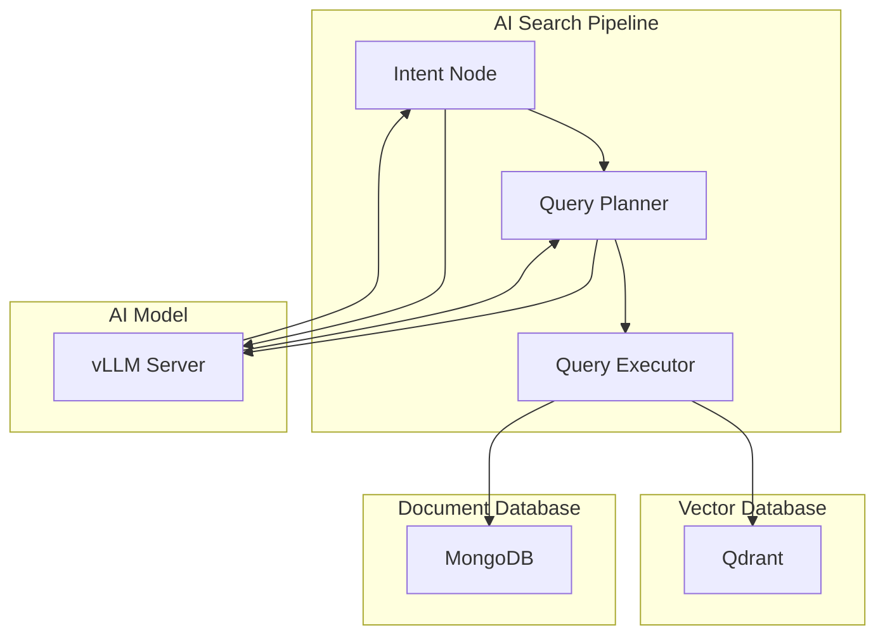

# AI Search Architecture

CodiesVibe features an advanced AI-powered search system that goes beyond simple keyword matching to understand user intent and provide highly relevant tool recommendations.

## 🧠 Architecture Overview

### 3-Node LangGraph Pipeline

Our search system uses a sophisticated 3-node pipeline built with LangGraph:



#### Node 1: Intent Analysis
- **Purpose**: Understand user's search intent and extract key entities
- **Input**: Natural language query ("AI tools for React developers with free tier")
- **Output**: Structured intent with entities, categories, and confidence scores
- **AI Model**: Analyzes query to identify:
  - Primary intent (code completion, debugging, testing, etc.)
  - Target platforms (React, Python, JavaScript)
  - Pricing preferences (free, freemium, paid)
  - User types (individual developers, teams, enterprises)

#### Node 2: Query Planning
- **Purpose**: Create optimal search strategy based on intent
- **Input**: Structured intent from Node 1
- **Output**: Execution plan with vector search parameters
- **Strategy Selection**:
  - Semantic search for concept matching
  - Categorical filtering for precise matching
  - Hybrid approaches for balanced results
  - Performance optimization for speed vs. accuracy

#### Node 3: Query Execution
- **Purpose**: Execute the search plan and merge results
- **Input**: Execution plan from Node 2
- **Output**: Ranked tool candidates with relevance scores
- **Operations**:
  - Multi-vector similarity search in Qdrant
  - Structured MongoDB queries for exact matches
  - Reciprocal Rank Fusion (RRF) for result merging
  - Result deduplication and filtering

## 🔍 Multi-Vector Search System

### Vector Types

We use multiple specialized vector embeddings to capture different aspects of tools:

#### 1. Semantic Vectors
- **Purpose**: Capture conceptual meaning and functionality
- **Content**: Tool descriptions, features, use cases
- **Model**: Sentence-transformers for semantic understanding
- **Use Case**: "AI tools for debugging" finds tools that help with debugging

#### 2. Category Vectors
- **Purpose**: Precise categorical matching
- **Content**: Tool categories, tags, classifications
- **Model**: Specialized categorical embeddings
- **Use Case**: "React components" finds tools specifically in React category

#### 3. Functionality Vectors
- **Purpose**: Match specific functional capabilities
- **Content**: Technical features, integrations, APIs
- **Model**: Function-aware embeddings
- **Use Case**: "Code completion" finds tools with code completion features

#### 4. Alias Vectors
- **Purpose**: Handle synonyms and alternative names
- **Content**: Common alternative terms and abbreviations
- **Model**: Synonym-aware embeddings
- **Use Case**: "IDE" matches "Integrated Development Environment"

#### 5. Tool Type Vectors
- **Purpose**: Classify tool types and deployment methods
- **Content**: SaaS, self-hosted, browser extension, desktop app
- **Model**: Type-specific embeddings
- **Use Case**: "Browser extension" finds only extension-based tools

### Vector Search Process

```typescript
interface VectorSearchRequest {
  query: string;
  intentState: IntentState;
  executionPlan: ExecutionPlan;
}

interface VectorSearchResponse {
  semanticResults: Candidate[];
  categoryResults: Candidate[];
  functionalityResults: Candidate[];
  aliasResults: Candidate[];
  toolTypeResults: Candidate[];
  mergedResults: Candidate[];
}
```

### Reciprocal Rank Fusion (RRF)

We use RRF to intelligently merge results from multiple vector searches:

```typescript
function reciprocalRankFusion(results: SearchResult[][]): Candidate[] {
  const k = 60; // RRF constant
  const scoreMap = new Map<string, number>();

  results.forEach((resultList, listIndex) => {
    resultList.forEach((result, rank) => {
      const currentScore = scoreMap.get(result.id) || 0;
      const newScore = currentScore + (1 / (k + rank + 1));
      scoreMap.set(result.id, newScore);
    });
  });

  return Array.from(scoreMap.entries())
    .sort(([,a], [,b]) => b - a)
    .map(([id, score]) => ({ id, score }));
}
```

## 🤖 AI Model Integration

### vLLM Configuration

Our system integrates with vLLM running on the host for high-performance inference:

```env
VLLM_BASE_URL=http://host.docker.internal:8000
VLLM_MODEL=Qwen/Qwen3-0.6B
```

### Model Capabilities

- **Intent Understanding**: Analyzes natural language queries
- **Entity Extraction**: Identifies key concepts and requirements
- **Strategy Planning**: Determines optimal search approaches
- **Result Reasoning**: Explains why tools are recommended

### Fallback Behavior

If vLLM is unavailable, the system gracefully degrades:

1. **Rule-based Intent**: Predefined patterns for common queries
2. **Keyword Search**: Fallback to traditional text search
3. **Cached Results**: Use previous successful searches
4. **Basic Hybrid**: Simple combination of semantic and structured search

## 📊 Search API Endpoints

### Primary Search Endpoint

```http
POST /search
Content-Type: application/json

{
  "query": "AI tools for React developers with free tier",
  "limit": 10,
  "debug": false
}
```

#### Response Structure

```json
{
  "query": "AI tools for React developers with free tier",
  "intentState": {
    "primaryIntent": "code_completion",
    "confidence": 0.95,
    "entities": {
      "platform": ["React"],
      "pricing": ["free", "freemium"],
      "functionality": ["code_completion", "suggestions"]
    }
  },
  "executionPlan": {
    "strategy": "semantic_hybrid",
    "explanation": "Using semantic search with React and free tier filtering",
    "vectorTypes": ["semantic", "entities.categories", "composites.toolType"],
    "filters": {
      "pricingModels": ["free", "freemium"],
      "platforms": ["React"]
    }
  },
  "candidates": [
    {
      "id": "github-copilot",
      "score": 0.92,
      "source": "semantic",
      "metadata": {
        "name": "GitHub Copilot",
        "description": "AI pair programmer",
        "pricing": "freemium",
        "platforms": ["VS Code", "JetBrains"]
      }
    }
  ],
  "executionStats": {
    "totalTimeMs": 245,
    "nodeTimings": {
      "intentExtraction": 89,
      "queryPlanning": 45,
      "queryExecution": 111
    },
    "vectorQueriesExecuted": 4,
    "structuredQueriesExecuted": 2
  },
  "executionTime": "245ms",
  "phase": "3-Node LLM-First Pipeline",
  "strategy": "semantic_hybrid"
}
```

### Health Check

```http
GET /health
```

#### Response

```json
{
  "status": "healthy",
  "services": {
    "mongodb": "connected",
    "qdrant": "connected",
    "vllm": "connected"
  },
  "vectorIndex": {
    "collectionHealthy": true,
    "sampleValidationPassed": true,
    "missingVectors": 0,
    "orphanedVectors": 0
  }
}
```

## 🔧 Configuration

### Search Parameters

```env
# Multi-vector search configuration
SEARCH_USE_MULTIVECTOR=true
MULTIVECTOR_MAX_RESULTS=20
VECTOR_TYPES=semantic,entities.categories,entities.functionality,entities.aliases,composites.toolType

# RRF configuration
SEARCH_RRF_K=60
SEARCH_SOURCE_WEIGHTS={"mongodb": 0.3, "qdrant": 0.7}
DEDUPE_THRESHOLD=0.8

# Performance settings
ENRICHMENT_TIMEOUT_MS=2000
MAX_ENTITY_COUNT=10
ENABLE_CACHE=true
CACHE_TTL=3600
```

### Vector Indexing

Tools are automatically indexed when added or updated through the UI. The system handles vector generation and indexing automatically.

```bash
# Create collections (if needed)
npm run create-collections

# Validate index health
curl http://localhost:4003/health
```

## 🎯 Search Examples

### Example 1: Platform-Specific Search

**Query**: "AI tools for Python developers"

```json
{
  "intentState": {
    "primaryIntent": "development_tools",
    "entities": {
      "platform": ["Python"],
      "userType": ["developer"]
    }
  },
  "executionPlan": {
    "strategy": "platform_specific",
    "filters": {
      "platforms": ["Python"],
      "categories": ["development", "automation"]
    }
  }
}
```

### Example 2: Pricing-Conscious Search

**Query**: "Free AI tools for startups"

```json
{
  "intentState": {
    "primaryIntent": "cost_effective_tools",
    "entities": {
      "pricing": ["free"],
      "organization": ["startup"]
    }
  },
  "executionPlan": {
    "strategy": "price_filtered",
    "filters": {
      "pricingModels": ["free"],
      "targetUsers": ["startup", "smb"]
    }
  }
}
```

### Example 3: Feature-Specific Search

**Query**: "AI code review and debugging tools"

```json
{
  "intentState": {
    "primaryIntent": "code_quality",
    "entities": {
      "functionality": ["code_review", "debugging", "analysis"]
    }
  },
  "executionPlan": {
    "strategy": "feature_specific",
    "vectorTypes": ["semantic", "entities.functionality"],
    "filters": {
      "capabilities": ["code_review", "debugging"]
    }
  }
}
```

## 📈 Performance Optimization

### Caching Strategy

- **Intent Cache**: Cache intent analysis for common queries
- **Vector Cache**: Cache vector embeddings for frequently searched terms
- **Result Cache**: Cache search results for identical queries
- **Plan Cache**: Cache execution plans for similar intent patterns

### Vector Index Optimization

```typescript
// Optimized vector search parameters
const searchParams = {
  exact: false,           // Allow approximate search for speed
  hnsw_ef: 128,          // HNSW search parameter
  payload: {             // Include metadata in results
    select: ['name', 'description', 'pricing', 'platforms']
  },
  limit: 20,             // Limit results for performance
  score_threshold: 0.3   // Filter low-relevance results
};
```

### Monitoring and Metrics

- **Search Latency**: Track end-to-end search time
- **Node Performance**: Monitor each pipeline node's execution time
- **Cache Hit Rates**: Measure caching effectiveness
- **Vector Index Health**: Monitor collection status and performance

## 🔮 Future Enhancements

### Planned Features

1. **Learning from User Feedback**: Improve recommendations based on user interactions
2. **Personalized Search**: Tailor results to user's tool preferences and history
3. **Multi-Modal Search**: Include image and video content in search
4. **Real-time Updates**: Immediate indexing of new tools and updates
5. **Advanced Filtering**: More granular filtering options and faceted search

### Research Areas

- **Federated Learning**: Improve models while preserving privacy
- **Cross-lingual Search**: Support for tools in multiple languages
- **Explainable AI**: Better explanations for search recommendations
- **Knowledge Graphs**: Rich relationships between tools and concepts

---

**📚 Related Documentation**:
- [Search API Reference](./search-api.md) - Complete API documentation
- [Installation Guide](./installation.md) - Setup and configuration
- [Vector Database Setup](./vector-database.md) - Qdrant configuration