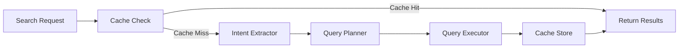

<div align="center">

# 🔍 CodiesVibe Search API

**AI-Powered Semantic Search Engine with LangGraph Orchestration**

[](https://www.typescriptlang.org/)
[](https://nodejs.org/)
[](LICENSE)
[](https://www.docker.com/)
[](https://github.com/langchain-ai/langgraph)

A production-ready, schema-driven AI search service powered by LangGraph for intelligent tool discovery using multi-vector similarity, agentic query planning, and LLM-based intent extraction.

[Quick Start](#-quick-start) • [Documentation](#-documentation) • [API Reference](docs/API.md) • [Contributing](docs/CONTRIBUTING.md)

</div>

---

## ✨ Features

### 🎯 Core Capabilities
- **Agentic Search Pipeline**: 5-node LangGraph orchestration with intelligent caching
- **Multi-Vector Semantic Search**: Search across semantic, categorical, functional, and interface dimensions
- **LLM-Powered Intelligence**: Intent extraction and dynamic query planning using Together AI
- **Schema-Driven Design**: Domain-agnostic core with pluggable domain configurations

### 🛡️ Production Ready
- **Enterprise Security**: Comprehensive input validation, rate limiting, malicious pattern detection
- **Observability**: Prometheus metrics, Winston logging, health checks (liveness/readiness)
- **Resilience**: Circuit breakers, graceful shutdown, timeout protection
- **Performance**: Response compression, request caching, optimized vector queries

### 🏗️ Developer Experience
- **Full TypeScript**: Strict type safety across the codebase
- **Testing**: Jest unit tests with MongoDB Memory Server
- **API Docs**: Interactive OpenAPI/Swagger UI at `/api-docs`
- **Docker Ready**: Multi-stage builds with health checks

---

## 🏛️ Architecture

### Pipeline Flow



**5-Node LangGraph Pipeline:**
1. **CacheCheckNode** - Vector-based cache lookup
2. **IntentExtractorNode** - LLM-powered intent extraction
3. **QueryPlannerNode** - Dynamic execution strategy
4. **QueryExecutorNode** - Multi-source query execution (Qdrant + MongoDB)
5. **CacheStoreNode** - Result persistence

> 📖 **Learn more**: [Architecture Documentation](docs/ARCHITECTURE.md)

---

## 📋 Prerequisites

- **Node.js** >= 24.x
- **Docker** >= 20.x & **Docker Compose** >= 2.x
- **Together AI API Key** ([Get one here](https://api.together.xyz/))
- **Clerk Account** ([Sign up](https://clerk.com/))

**Optional**: MongoDB Atlas, Qdrant Cloud (for production)

---

## 🚀 Quick Start

### 1. Clone and Configure

```bash
# Clone the repository
git clone https://github.com/yourusername/codiesvibe.git
cd codiesvibe/search-api

# Copy and configure environment variables
cp .env.example .env
# Edit .env and add your TOGETHER_API_KEY and CLERK_SECRET_KEY
```

### 2. Start Services

```bash
# Start MongoDB, Qdrant, and Search API
docker-compose up -d --build

# Verify services are healthy
docker-compose ps
```

### 3. Vector Database

Qdrant collections are automatically created when the server starts. Vector indexing happens automatically when tools are added or updated through the UI.

### 4. Test the API

```bash
# Search request
curl -X POST http://localhost:4003/api/search \
  -H "Content-Type: application/json" \
  -d '{
    "query": "AI code completion tools",
    "limit": 10
  }'
```

**Access API Documentation**: [http://localhost:4003/api-docs](http://localhost:4003/api-docs)

> 📖 **Detailed setup**: [Installation Guide](docs/INSTALLATION.md)

---

## 📡 Basic API Usage

### Search Endpoint

**Request:**
```bash
POST /api/search
Content-Type: application/json

{
  "query": "AI code completion tools",
  "limit": 10,
  "debug": false
}
```

**Response:**
```json
{
  "query": "AI code completion tools",
  "intentState": {
    "primaryIntent": "code_completion",
    "confidence": 0.95,
    "entities": {
      "categories": ["AI", "Developer Tools"]
    }
  },
  "results": [...],
  "executionTime": "245ms"
}
```

### Health Check

```bash
# Basic health
curl http://localhost:4003/health

# Readiness probe (checks MongoDB + Qdrant)
curl http://localhost:4003/health/ready
```

> 📖 **Complete API reference**: [API Documentation](docs/API.md)

---

## 📚 Documentation

| Document | Description |
|----------|-------------|
| [Installation](docs/INSTALLATION.md) | Docker & local setup, environment configuration |
| [Architecture](docs/ARCHITECTURE.md) | Schema-driven design, LangGraph pipeline, multi-vector search |
| [API Reference](docs/API.md) | Complete endpoint reference with examples |
| [Configuration](docs/CONFIGURATION.md) | Environment variables, vector types, search tuning |
| [Development](docs/DEVELOPMENT.md) | Local development workflow, scripts, project structure |
| [Testing](docs/TESTING.md) | Unit, E2E, integration, and security tests |
| [Deployment](docs/DEPLOYMENT.md) | Production deployment, Docker, PM2, scaling |
| [Monitoring](docs/MONITORING.md) | Health checks, Prometheus metrics, logging |
| [Troubleshooting](docs/TROUBLESHOOTING.md) | Common issues and solutions |
| [FAQ](docs/FAQ.md) | Frequently asked questions |
| [Contributing](docs/CONTRIBUTING.md) | Contribution guidelines and code standards |
| [Security](SECURITY.md) | Security features and best practices |

---

## 🛠️ Development

```bash
# Install dependencies
npm install

# Start infrastructure (MongoDB + Qdrant)
docker-compose -f docker-compose.infra.yml up -d

# Start dev server with hot reload
npm run dev

# Run tests
npm test

# Type checking
npm run typecheck
```

> 📖 **Full development guide**: [Development Documentation](docs/DEVELOPMENT.md)

---

## 🚀 Deployment

### Docker (Recommended)

```bash
docker build -t search-api:latest .
docker-compose -f docker-compose.production.yml up -d
```

### PM2

```bash
npm run build
npm run start:prod:pm2
```

> 📖 **Production setup**: [Deployment Guide](docs/DEPLOYMENT.md)

---

## 🔒 Security

The API implements comprehensive security measures including:

✅ Dual-layer input validation (express-validator + Joi)
✅ Malicious pattern detection (XSS, SQL injection, command injection)
✅ Multi-tier rate limiting
✅ Security headers (Helmet with CSP)
✅ NoSQL injection protection
✅ HTTP Parameter Pollution prevention
✅ CORS with origin validation
✅ Clerk-based authentication

**Security Test:**
```bash
npx tsx test-security-validation.ts
# Expected: 16/16 malicious patterns blocked, 8/8 legitimate queries allowed
```

> 📖 **Security details**: [SECURITY.md](SECURITY.md)

---

## 🤝 Contributing

We welcome contributions! Please read our [Contributing Guide](docs/CONTRIBUTING.md) for:

- Getting started with development
- Code standards and guidelines
- Commit message format
- Pull request process

---

## 📄 License

This project is licensed under the **MIT License** - see the [LICENSE](../LICENSE) file for details.

---

## 💬 Support

- **Documentation**: Browse the [docs](docs/) directory
- **Issues**: [GitHub Issues](https://github.com/yourusername/codiesvibe/issues)
- **Discussions**: [GitHub Discussions](https://github.com/yourusername/codiesvibe/discussions)

---

## 🙏 Acknowledgments

Built with [LangGraph](https://github.com/langchain-ai/langgraph), [Qdrant](https://qdrant.tech/), [MongoDB](https://www.mongodb.com/), [Together AI](https://together.ai/), and [TypeScript](https://www.typescriptlang.org/).

---

<div align="center">

**[⬆ Back to Top](#-codiesvibe-search-api)**

Made with ❤️ by the CodiesVibe Team

</div>
