# LangGraph Search API - Architecture Guide

## System Architecture Overview

The LangGraph Search API is built on a sophisticated multi-layered architecture that leverages LangGraph for state management and orchestration. The system processes natural language queries through a series of specialized stages, each responsible for different aspects of search understanding and execution.

## High-Level Architecture

```
┌─────────────────────────────────────────────────────────────────┐
│                        API Layer                                │
├─────────────────────────────────────────────────────────────────┤
│  Express Server • REST Endpoints • Async Operations • Error      │
│  Handling • Request Validation • Response Formatting            │
└─────────────────────────────────────────────────────────────────┘
                              │
                              ▼
┌─────────────────────────────────────────────────────────────────┐
│                    LangGraph Orchestration                       │
├─────────────────────────────────────────────────────────────────┤
│  State Management • Checkpointing • Thread Management •         │
│  Error Recovery • State Validation • Rollback Mechanisms        │
└─────────────────────────────────────────────────────────────────┘
                              │
                              ▼
┌─────────────────────────────────────────────────────────────────┐
│                    Processing Pipeline                          │
├─────────────────────────────────────────────────────────────────┤
│  Intent Extraction • Query Planning • Execution • Completion    │
│  ┌─────────────────┐ ┌─────────────────┐ ┌─────────────────┐   │
│  │ Intent Graph    │ │ Planning Graph  │ │ Execution Graph │   │
│  │ (13 nodes)      │ │ (5 nodes)       │ │ (3 nodes)       │   │
│  └─────────────────┘ └─────────────────┘ └─────────────────┘   │
└─────────────────────────────────────────────────────────────────┘
                              │
                              ▼
┌─────────────────────────────────────────────────────────────────┐
│                     Service Layer                              │
├─────────────────────────────────────────────────────────────────┤
│  Embedding Service • MongoDB Service • Qdrant Service •         │
│  Vector Indexing • State Management • Monitoring               │
└─────────────────────────────────────────────────────────────────┘
                              │
                              ▼
┌─────────────────────────────────────────────────────────────────┐
│                    Infrastructure                              │
├─────────────────────────────────────────────────────────────────┤
│  MongoDB • Qdrant • Ollama • Express • Node.js • TypeScript   │
└─────────────────────────────────────────────────────────────────┘
```

## LangGraph Orchestration Flow

### Main Graph Architecture

The main search graph consists of four primary nodes that orchestrate the entire search process:

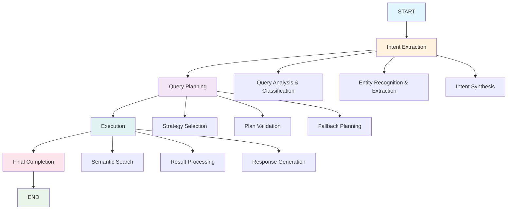

### State Management System

The state management system is built around LangGraph's StateAnnotation, which provides a type-safe schema for data flow through the system:

#### Core State Schema
```typescript
export const StateAnnotation = Annotation.Root({
  // Input
  query: Annotation<string>,
  
  // Preprocessing
  preprocessedQuery: Annotation<string>,
  
  // Intent Extraction
  intent: Annotation<Intent>,
  confidence: Annotation<{
    overall: number;
    breakdown: Record<string, number>;
  }>,
  extractionSignals: Annotation<ExtractionSignals>,
  
  // Routing
  routingDecision: Annotation<"optimal" | "multi-strategy" | "fallback">,
  
  // Planning
  plan: Annotation<Plan>,
  
  // Execution
  executionResults: Annotation<any[]>,
  queryResults: Annotation<any[]>,
  
  // Final Results
  completion: Annotation<CompletionResult>,
  
  // Quality Assessment
  qualityAssessment: Annotation<QualityAssessment>,
  
  // Iteration Control
  iterations: Annotation<IterationControl>,
  
  // Error Handling
  errors: Annotation<Array<ErrorRecord>>,
  
  // Metadata
  metadata: Annotation<ExecutionMetadata>
});
```

#### State Flow Through System

1. **Initial State**: Contains original query and metadata
2. **Intent Extraction**: Populates intent, confidence, and extraction signals
3. **Query Planning**: Adds routing decisions and execution plans
4. **Execution**: Populates results and quality metrics
5. **Completion**: Finalizes results with explanation and metadata

## Component Interactions

### 1. Intent Extraction Subgraph

The intent extraction subgraph is the most complex component, featuring 13 specialized nodes:

#### Node Sequence and Responsibilities

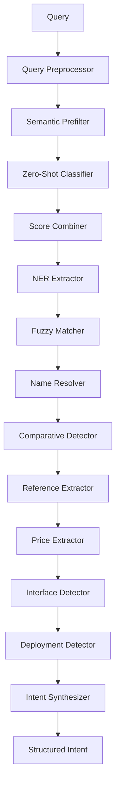

**Key Components**:
- **Query Preprocessor**: Normalizes and cleans input queries
- **Semantic Prefilter**: Provides semantic context for classification
- **Zero-Shot Classifier**: Categorizes queries using pre-trained embeddings
- **Score Combiner**: Aggregates classification results
- **NER Extractor**: Extracts named entities from queries
- **Fuzzy Matcher**: Finds approximate tool name matches
- **Name Resolver**: Resolves ambiguous tool references
- **Comparative Detector**: Identifies comparison queries
- **Reference Extractor**: Extracts tool references for comparison
- **Feature Extractors**: Extract price, interface, and deployment preferences
- **Intent Synthesizer**: Combines all signals into structured intent

### 2. Query Planning Subgraph

The query planning subgraph determines the optimal search strategy:

#### Strategy Selection Logic

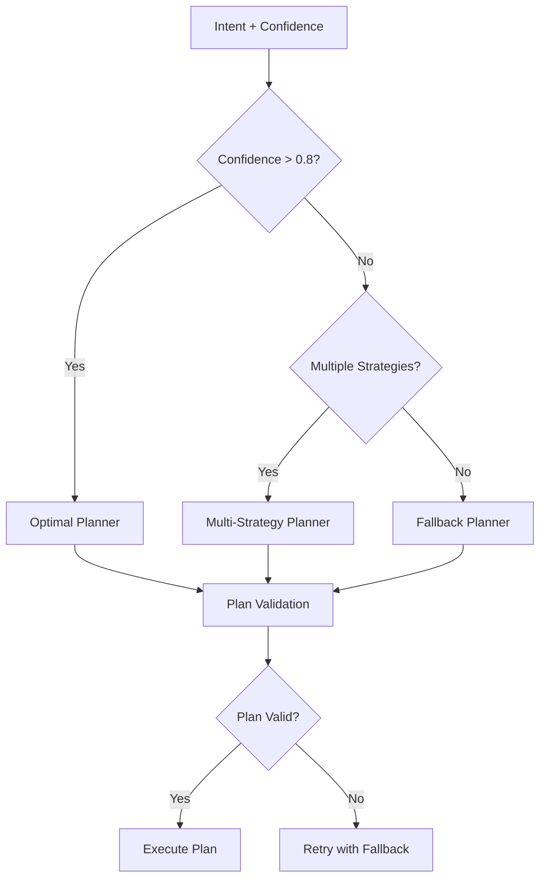

**Planning Strategies**:
- **Optimal Planner**: Uses high-confidence intent for precise search
- **Multi-Strategy Planner**: Executes multiple strategies in parallel
- **Fallback Planner**: Ensures baseline search functionality

### 3. Execution Subgraph

The execution subgraph implements the search plan:

#### Execution Flow

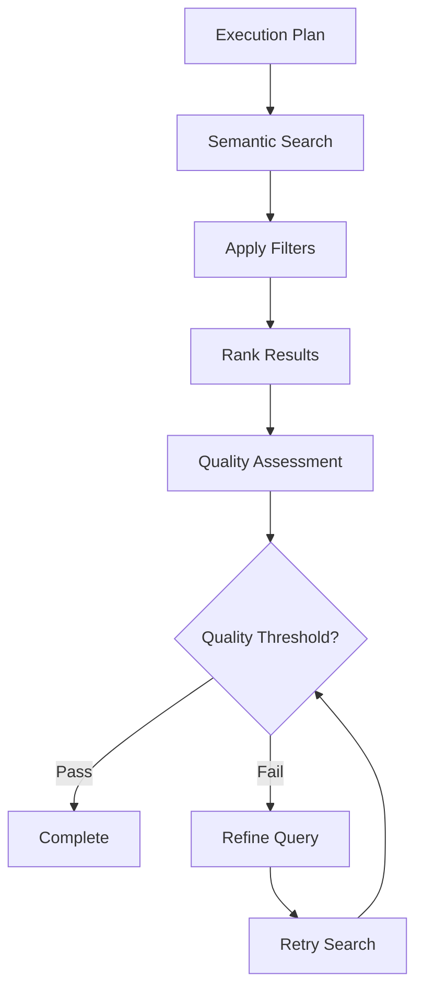

**Execution Components**:
- **Semantic Search**: Vector-based similarity search using Qdrant
- **Filter Application**: Applies category, price, and deployment filters
- **Result Ranking**: Relevance-based ranking with multiple factors
- **Quality Assessment**: Evaluates result quality and determines need for refinement

## Data Flow Through the System

### Request Processing Flow

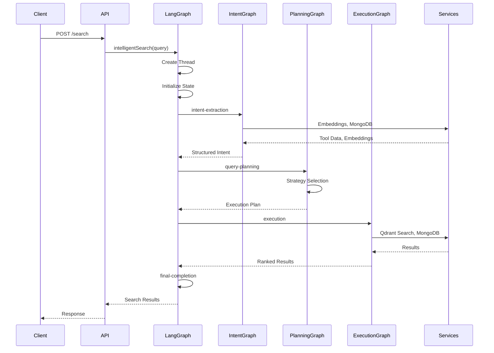

### State Transformation Flow

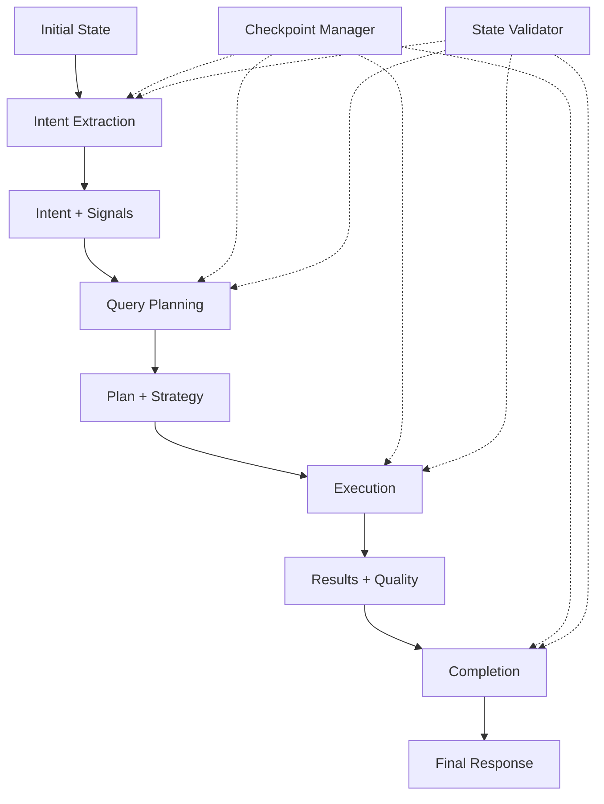

## Checkpointing and Recovery System

### Checkpoint Architecture

The checkpointing system provides state persistence and recovery capabilities:

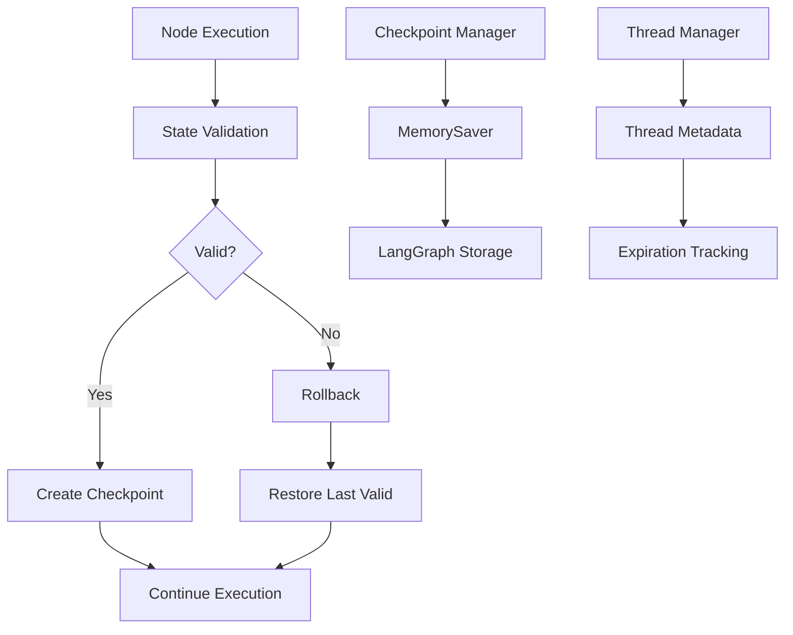

### Recovery Strategies

1. **Automatic Recovery**: System automatically attempts recovery on failures
2. **Manual Recovery**: Users can resume failed searches from checkpoints
3. **Partial Recovery**: Returns partial results when complete recovery fails

## Service Layer Architecture

### Core Services

#### 1. Embedding Service
```typescript
class EmbeddingService {
  // Ollama-based embedding generation with mxbai-embed-large model
  // In-memory caching with size management
  // Batch processing for multiple texts
  // Pre-computed enum embeddings for categories/functionality
  // Similarity search for enum values
}
```

#### 2. MongoDB Service
```typescript
class MongoDBService {
  // Tool data storage and retrieval with ObjectId support
  // CRUD operations with advanced filtering
  // Connection pooling and error handling
  // Search by name, ID, and custom criteria
  // Batch operations for multiple tools
}
```

#### 3. Qdrant Service
```typescript
class QdrantService {
  // Vector similarity search with embedding-based queries
  // Collection management and health checks
  // Deterministic UUID mapping for point IDs
  // Tool upsert/delete operations
  // Advanced filtering and payload management
}
```

#### 4. Vector Indexing Service
```typescript
class VectorIndexingService {
  // Automated vector indexing with batch processing
  // Weighted content generation from tool metadata
  // Index validation and health reporting
  // Retry logic for transient failures
  // Progress tracking and graceful shutdown
}
```

#### 5. Vector Seeding Service
```typescript
class VectorSeedingService {
  // Complete vector database seeding workflow
  // Progress monitoring and statistics tracking
  // Validation and health reporting
  // Error handling and recovery mechanisms
  // Configurable batch processing options
}
```

### Service Integration

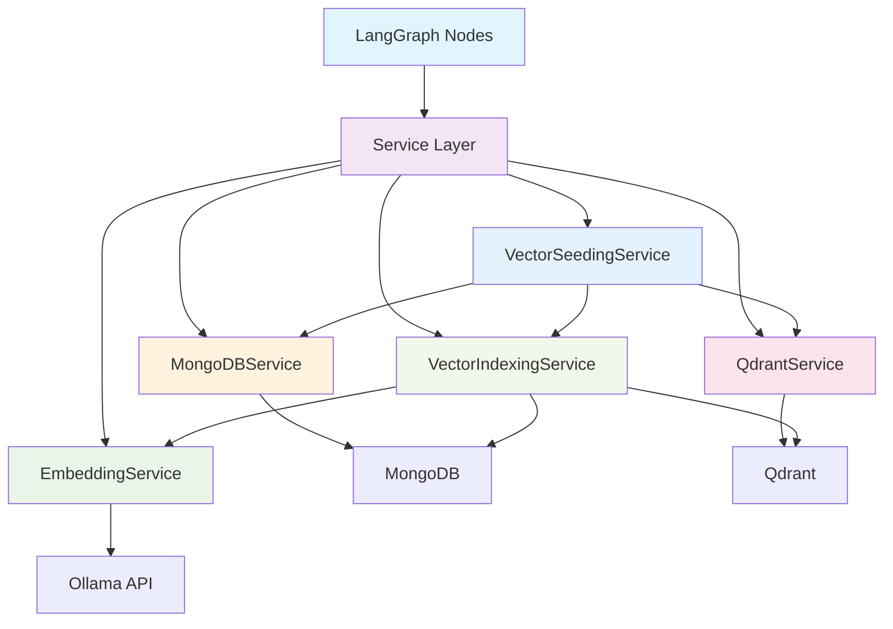

## Monitoring and Observability

### State Monitoring System

The system includes internal monitoring for state transitions and performance tracking:

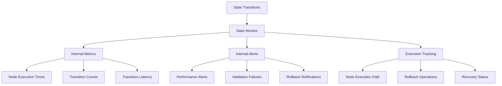

### Currently Implemented Metrics

1. **Performance Metrics** ✅
   - Node execution times
   - Total execution time
   - Transition latency
   - Transition counts

2. **Quality Metrics** ✅
   - State validation failures
   - Rollback operations
   - Recovery success rates

3. **Execution Tracking** ✅
   - Node execution path tracking
   - Rollback operation tracking
   - Recovery status monitoring

### Current Implementation Limitations

**Note**: The current monitoring system is primarily designed for **internal debugging and development**. The following features from the original architecture design are **not yet implemented**:

❌ **Missing Features**:
- Throughput measurements
- Result quality scores
- Thread utilization tracking
- Service health status
- Error rate calculations
- External API endpoints for monitoring data
- Integration with external monitoring systems (Prometheus, Grafana)
- Persistent alert storage
- Real-time monitoring dashboards

**Implementation Status**:
- ✅ **Internal State Monitor**: Fully implemented in `src/utils/state-monitor.ts`
- ✅ **Performance Tracking**: Execution times, transitions, validation failures
- ✅ **Alert System**: Internal alerts for performance issues and failures
- ❌ **External Access**: No API endpoints to expose monitoring data
- ❌ **Persistence**: All monitoring data stored in-memory only
- ❌ **Integration**: No external monitoring system integration

The monitoring system provides a solid foundation for debugging and performance analysis during development, but requires additional implementation for production observability needs.

## Error Handling and Resilience

### Error Handling Strategy

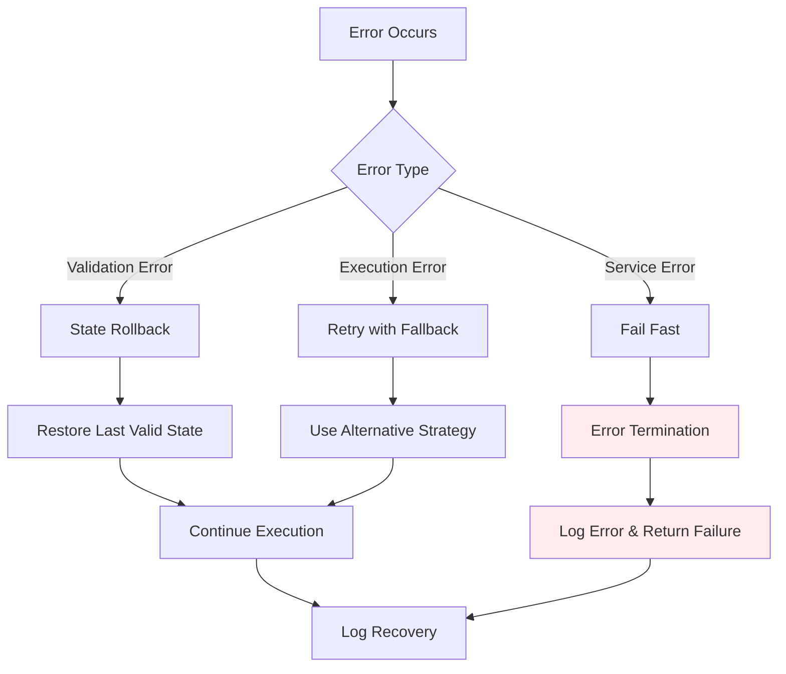

### Currently Implemented Resilience Features

1. **Automatic Rollback** ✅
   - State restoration on validation failures
   - Multiple rollback strategies (safe, aggressive, conservative)
   - Rollback history tracking and validation
   - Implemented in `src/utils/rollback-manager.ts`

2. **Fallback Strategies** ✅
   - Alternative execution paths when primary strategies fail
   - Multiple fallback planners for different scenarios
   - Emergency fallback plans for critical failures
   - Fallback routing decisions based on confidence levels

3. **Error Recovery** ✅
   - Checkpoint-based recovery mechanisms
   - Partial result recovery when complete recovery fails
   - Error recovery with state validation
   - Recovery status tracking and logging

4. **Comprehensive Logging** ✅
   - Detailed error tracking and debugging
   - Rollback operation logging
   - State validation failure logging
   - Debug metadata tracking throughout the system

### Current Implementation Limitations

**Note**: The current error handling system provides robust internal error recovery through rollbacks and fallbacks, but has limitations in external service failure scenarios:

❌ **Missing Features**:
- **Service Recovery**: No automatic service health monitoring during runtime
- **Graceful Degradation**: System fails completely when external services are unavailable
- **Dynamic Service Health Checks**: Only basic startup health checks are implemented
- **Automatic Service Reconnection**: No mechanisms to recover from external service failures
- **Reduced Functionality Modes**: No fallback modes when MongoDB, Qdrant, or Ollama are unavailable

**Current Behavior on Service Failures**:
- When MongoDB, Qdrant, or Ollama become unavailable during operation, the system fails fast rather than degrading gracefully
- No automatic retry mechanisms for external service connectivity
- Service failures result in immediate error termination rather than alternative execution paths

**Implementation Status**:
- ✅ **Internal Error Recovery**: Fully implemented with rollback and fallback mechanisms
- ✅ **State Management**: Comprehensive state validation and recovery
- ✅ **Fallback Planning**: Multiple fallback strategies for different failure scenarios
- ❌ **Service Recovery**: Only startup health checks, no runtime service monitoring
- ❌ **Graceful Degradation**: No reduced functionality modes for service failures

The error handling system provides excellent resilience for internal failures and state management issues, but requires additional implementation for external service recovery and graceful degradation capabilities.

## Configuration Management

### Configuration Architecture

The system uses a **decentralized configuration approach** with environment variables and separate configuration files:

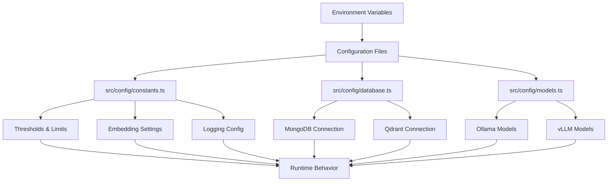

### Actual Configuration Structure

#### 1. **Constants and Thresholds** (`src/config/constants.ts`)
```typescript
// Confidence thresholds for routing decisions
export const confidenceThresholds = {
  high: 0.8,
  medium: 0.6,
  low: 0.4
};

// Quality thresholds for result validation
export const qualityThresholds = {
  minimum: 0.3,
  acceptable: 0.5,
  excellent: 0.8
};

// Embedding configuration
export const embeddingConfig = {
  model: 'mxbai-embed-large',
  cacheSize: 1000,
  batchSize: 10
};

// Search configuration
export const searchConfig = {
  maxResults: 20,
  minSimilarity: 0.7
};
```

#### 2. **Database Configuration** (`src/config/database.ts`)
```typescript
// MongoDB connection settings
export const mongoConfig = {
  uri: process.env.MONGODB_URI || 'mongodb://localhost:27017/codiesvibe',
  options: {
    maxPoolSize: 10,
    serverSelectionTimeoutMS: 5000,
    socketTimeoutMS: 45000,
  }
};

// Qdrant vector database settings
export const qdrantConfig = {
  host: process.env.QDRANT_HOST || 'localhost',
  port: parseInt(process.env.QDRANT_PORT) || 6333,
  collection: 'tools',
  timeout: 30000
};
```

#### 3. **Model Configuration** (`src/config/models.ts`)
```typescript
// Ollama configuration
export const ollamaConfig = {
  host: process.env.OLLAMA_HOST || 'http://localhost:11434',
  embeddingModel: 'mxbai-embed-large',
  timeout: 30000
};

// vLLM configuration (alternative to Ollama)
export const vllmConfig = {
  host: process.env.VLLM_HOST || 'http://localhost:8000',
  model: process.env.VLLM_MODEL || 'mistral-7b',
  timeout: 30000
};

// Available models
export const modelConfigs = {
  embedding: 'mxbai-embed-large',
  classification: 'mistral-7b',
  generation: 'llama2-7b'
};
```

#### 4. **Specialized Configuration Classes**
```typescript
// Checkpoint configuration (used in checkpoint-manager.ts)
export const checkpointConfig = {
  maxCheckpointsPerThread: 10,
  compressionEnabled: true,
  ttl: 3600000 // 1 hour
};

// Rollback configuration (used in rollback-manager.ts)
export const rollbackConfig = {
  maxRollbackAttempts: 3,
  rollbackStrategy: 'safe', // 'safe' | 'aggressive' | 'conservative'
  enableHistory: true
};

// Validation configuration (used in state-validator.ts)
export const validationConfig = {
  enableStrictValidation: true,
  enableConsistencyChecks: true,
  enableAutoRollback: true,
  maxValidationRetries: 3
};
```

### Configuration Loading and Usage

#### **Environment Variables**
```bash
# Database connections
MONGODB_URI=mongodb://localhost:27017/codiesvibe
QDRANT_HOST=localhost
QDRANT_PORT=6333

# Model services
OLLAMA_HOST=http://localhost:11434
VLLM_HOST=http://localhost:8000
VLLM_MODEL=mistral-7b

# Feature flags
ENABLE_CACHE=true
ENABLE_METRICS=false
LOG_LEVEL=info
```

#### **Configuration Access Pattern**
```typescript
// Constants are imported directly
import { confidenceThresholds, embeddingConfig } from '../config/constants';
import { mongoConfig, qdrantConfig } from '../config/database';

// Used throughout the codebase
const threshold = confidenceThresholds.high;
const embedding = await embeddingService.generate(text, embeddingConfig);
```

### Current Implementation Limitations

**Note**: The current configuration system is simple and effective but has some limitations:

❌ **Missing Features**:
- **Runtime Configuration Updates**: Configuration is loaded at startup only
- **Centralized Configuration Management**: No single configuration manager class
- **Configuration Validation**: No automatic validation of configuration values
- **Configuration Hierarchy**: No layering or override system
- **Node-level Configuration**: No individual node configuration
- **Hot Reload**: Changes require restart to take effect

❌ **Current Constraints**:
- Configuration is fragmented across multiple files
- No type safety for environment variables
- No configuration schema validation
- No configuration versioning or migration system

**Implementation Status**:
- ✅ **Environment-based Configuration**: Fully implemented with environment variables
- ✅ **File-based Configuration**: Multiple configuration files for different concerns
- ✅ **Specialized Config Classes**: Configuration for specific components (checkpoint, rollback, validation)
- ❌ **Centralized Management**: No unified configuration system
- ❌ **Runtime Updates**: No dynamic configuration changes

The configuration system provides a straightforward approach that works well for the current system requirements, but could benefit from a more centralized and validated configuration management approach for larger deployments.

## Performance Considerations

### Optimization Strategies

1. **Caching**: Embedding caching and result caching
2. **Batch Processing**: Efficient batch operations for embeddings
3. **Connection Pooling**: Database connection management
4. **Async Operations**: Non-blocking I/O throughout the system
5. **State Compression**: Efficient state storage for checkpoints

### Scaling Considerations

1. **Horizontal Scaling**: Multiple service instances
2. **Vertical Scaling**: Resource optimization
3. **Load Balancing**: Request distribution
4. **Resource Management**: Memory and CPU optimization

## Security Architecture

### Current Security Implementation

The current system implements basic security measures focused on input validation and error handling:

#### **Currently Implemented Security Features** ✅

1. **Input Validation**: Query sanitization and validation
   - Basic query validation in preprocessing nodes
   - Input sanitization in search endpoints
   - State validation throughout the pipeline

2. **Error Handling**: Secure error responses
   - Generic error messages to prevent information disclosure
   - Comprehensive error logging for debugging
   - Graceful failure handling

3. **Data Protection**: Basic data handling
   - Environment variable usage for sensitive configuration
   - Secure database connection configurations
   - Basic input sanitization

### Current Security Limitations

**Note**: The current security implementation is minimal and suitable for development/testing environments:

❌ **Missing Security Features**:
- **Access Control**: No API authentication or authorization system
- **Rate Limiting**: No request throttling or abuse prevention
- **Audit Logging**: No comprehensive audit trails for security events
- **Data Encryption**: No encryption for sensitive data at rest or in transit
- **CORS Configuration**: Basic CORS handling only
- **API Key Management**: No API key or token-based authentication
- **Request Validation**: Limited request payload validation
- **Security Headers**: No security headers (CSP, HSTS, etc.)
- **Session Management**: No session handling or management

### Current Security Reality

**Actual Security Posture**:
- ✅ **Input Validation**: Basic query and input sanitization
- ✅ **Error Handling**: Secure error responses
- ✅ **Environment Variables**: Sensitive data stored in environment variables
- ❌ **Authentication**: No user authentication system
- ❌ **Authorization**: No access control mechanisms
- ❌ **Audit Trail**: No security event logging
- ❌ **Rate Limiting**: No request throttling
- ❌ **Data Protection**: Basic configuration only

**Security Recommendations**:
The current system is designed for development and internal use. For production deployment, the following security measures should be implemented:

1. **API Authentication**: Add JWT-based or API key authentication
2. **Rate Limiting**: Implement request throttling
3. **Audit Logging**: Add comprehensive security event logging
4. **Data Encryption**: Encrypt sensitive data at rest and in transit
5. **Security Headers**: Implement security-focused HTTP headers
6. **Input Validation**: Enhance request payload validation
7. **Access Control**: Implement role-based access control

The security architecture provides a foundation that can be extended with comprehensive security features for production deployments.

## Future Architecture Enhancements

### Immediate Priorities (Based on Current Limitations)

1. **External Monitoring APIs**: Implement REST endpoints to expose internal monitoring data
2. **Service Recovery**: Add automatic service health monitoring and recovery mechanisms
3. **Graceful Degradation**: Implement fallback modes when external services are unavailable
4. **Centralized Configuration**: Create a unified configuration management system
5. **Security Hardening**: Add authentication, authorization, and rate limiting

### Medium-term Enhancements

1. **Enhanced Error Handling**: Improve service failure recovery and retry mechanisms
2. **Performance Monitoring**: Add comprehensive metrics collection and external integration
3. **Configuration Validation**: Implement automatic configuration validation and type safety
4. **Caching Improvements**: Add result caching and more sophisticated embedding cache management
5. **API Documentation**: Implement comprehensive API documentation and testing tools

### Long-term Architectural Goals

1. **Distributed Processing**: Multi-node processing capabilities for horizontal scaling
2. **Advanced Caching**: Multi-layer caching strategies with Redis integration
3. **Machine Learning**: Enhanced intent detection and result ranking algorithms
4. **Real-time Updates**: Live result streaming and incremental updates
5. **Advanced Analytics**: Usage analytics, performance optimization, and A/B testing

### Currently Available Extension Points

The architecture provides several extension points that are immediately usable:

1. **Custom Nodes**: Add new processing nodes to the intent extraction pipeline
2. **Alternative Strategies**: Implement new search strategies in the planning phase
3. **Service Integrations**: Add new data sources and external services
4. **Filter Functions**: Extend the filtering system with new criteria
5. **Validation Rules**: Add custom state validation logic

### Implementation Reality Check

**Current State**: The system provides a solid foundation with excellent internal capabilities but limited external integrations.

**Recommended Approach**:
1. **Phase 1**: Address the current limitations (monitoring APIs, service recovery, configuration management)
2. **Phase 2**: Enhance existing features (performance, security, caching)
3. **Phase 3**: Implement advanced features (distributed processing, ML integration)

**Key Insight**: The architecture is well-designed for extensibility, but the current implementation focuses on core functionality. The extension points are functional and can be used to incrementally add new capabilities.

This approach ensures that future enhancements build upon the solid foundation while addressing the current practical limitations identified in this architecture guide.

## Conclusion

The LangGraph Search API architecture represents a sophisticated approach to intelligent search systems, combining state-of-the-art language processing with robust engineering practices. The modular design, comprehensive error handling, and extensive monitoring capabilities provide a solid foundation for scalable and reliable search operations.

The architecture's strength lies in its flexibility and extensibility, allowing for continuous improvement and adaptation to changing requirements. The comprehensive state management and checkpointing system ensures reliability and consistency, while the multi-stage processing pipeline delivers high-quality search results.

This architecture provides an excellent foundation for future enhancements and scaling, making it well-suited for production deployment and long-term maintainability.
