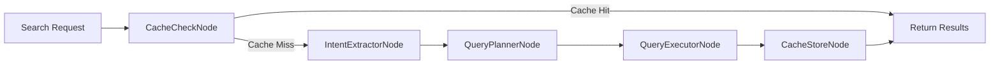

# Architecture Documentation

Comprehensive architecture guide for the CodiesVibe Search API.

## Table of Contents

- [Overview](#overview)
- [Schema-Driven Architecture (v3.0)](#schema-driven-architecture-v30)
- [LangGraph Pipeline](#langgraph-pipeline)
- [Multi-Vector Search](#multi-vector-search)
- [Domain Layer](#domain-layer)
- [Adding New Domains](#adding-new-domains)
- [System Components](#system-components)

---

## Overview

The CodiesVibe Search API is built on a **schema-driven architecture** that separates domain-agnostic core logic from domain-specific implementations. This design enables:

- **Extensibility**: Add new domains without modifying core framework
- **Maintainability**: Single source of truth for domain knowledge
- **Type Safety**: Full TypeScript validation across schema definitions
- **Testability**: Clear separation of concerns for unit testing

### Tech Stack

| Component | Technology | Purpose |
|-----------|------------|---------|
| **Orchestration** | LangGraph 0.2 | AI workflow and state management |
| **LLM** | Together AI | Intent extraction and query planning |
| **Vector DB** | Qdrant | Multi-vector similarity search |
| **Document DB** | MongoDB | Structured tool data storage |
| **Runtime** | Node.js 24.x | TypeScript execution environment |
| **API Framework** | Express.js | HTTP server and middleware |

---

## Schema-Driven Architecture (v3.0)

### Architecture Layers

```
┌─────────────────────────────────────────────────────────┐
│              Schema-Driven Pipeline (v3.0)              │
├─────────────────────────────────────────────────────────┤
│  🎯 Core Framework (Domain-Agnostic)                    │
│  src/core/                                              │
│    ├── types/schema.types.ts      DomainSchema interface│
│    ├── validators/                Schema validation     │
│    ├── prompts/                   Dynamic generation    │
│    └── pipeline.init.ts           Schema wiring         │
├─────────────────────────────────────────────────────────┤
│  🔧 Domain Layer (Tools-Specific)                       │
│  src/domains/tools/                                     │
│    ├── tools.schema.ts            Vocabularies & fields │
│    ├── tools.filters.ts           MongoDB mapping       │
│    └── tools.validators.ts        Query validation      │
├─────────────────────────────────────────────────────────┤
│  🤖 LangGraph Nodes (Schema-Powered)                    │
│  src/graphs/nodes/                                      │
│    ├── cache-check.node.ts       Vector cache lookup    │
│    ├── intent-extractor.node.ts  Uses schema prompts    │
│    ├── query-planner.node.ts     Uses domain handlers   │
│    ├── query-executor.node.ts    Executes with schema   │
│    └── cache-store.node.ts       Persist results        │
└─────────────────────────────────────────────────────────┘
```

### Core Principles

1. **Domain Separation**: Core framework code is completely separate from domain logic
2. **Schema Configuration**: All domain knowledge defined in `DomainSchema` interface
3. **Type Safety**: Full TypeScript validation across schema definitions
4. **Validation**: Schema validation at startup catches configuration errors early

### Before & After Comparison

| Before (v2.x) | After (v3.0) |
|--------------|--------------|
| ❌ 200+ lines of hardcoded prompts per node | ✅ Dynamic prompt generation from schema |
| ❌ 150+ lines of inline filter logic | ✅ Extracted to `tools.filters.ts` |
| ❌ Domain knowledge scattered across files | ✅ Single source of truth in `tools.schema.ts` |
| ❌ Difficult to maintain and extend | ✅ Easy to add new domains (3 files only) |
| ❌ Tight coupling between nodes and domain | ✅ Loosely coupled, pluggable architecture |

---

## LangGraph Pipeline

### Pipeline Flow



### Node Descriptions

#### 1. CacheCheckNode

**Purpose**: Vector-based cache lookup for similar queries

**Process**:
1. Generate embedding for incoming query
2. Search cache collection for similar queries (cosine similarity)
3. If similarity > threshold (0.85), return cached results
4. Otherwise, pass to Intent Extractor

**Benefits**:
- Reduces LLM API calls
- Improves response time (50-100ms vs 200-500ms)
- Lowers costs

**Location**: `src/graphs/nodes/cache-check.node.ts`

---

#### 2. IntentExtractorNode

**Purpose**: LLM-powered intent and entity extraction

**Process**:
1. Load prompt template from schema
2. Inject controlled vocabularies (categories, functionality, etc.)
3. Call Together AI with structured output
4. Parse and validate extracted intent

**Output Example**:
```json
{
  "primaryIntent": "code_completion",
  "confidence": 0.95,
  "entities": {
    "categories": ["AI", "Developer Tools"],
    "functionality": ["code completion", "autocomplete"],
    "userTypes": ["developers"]
  }
}
```

**Location**: `src/graphs/nodes/intent-extractor.node.ts`

---

#### 3. QueryPlannerNode

**Purpose**: Dynamic execution strategy selection

**Process**:
1. Analyze intent state from previous node
2. Determine optimal vector types to query
3. Decide on query strategy (semantic, hybrid, categorical, etc.)
4. Validate plan using domain validators

**Output Example**:
```json
{
  "strategy": "semantic_hybrid",
  "vectorTypes": ["semantic", "entities.categories"],
  "explanation": "Using semantic search with categorical filtering",
  "useStructuredFilters": true
}
```

**Location**: `src/graphs/nodes/query-planner.node.ts`

---

#### 4. QueryExecutorNode

**Purpose**: Multi-source query execution

**Process**:
1. Execute Qdrant vector queries (based on plan)
2. Execute MongoDB structured queries (based on filters)
3. Merge results using RRF (Reciprocal Rank Fusion)
4. Deduplicate and score
5. Return ranked candidates

**Sources**:
- **Qdrant**: Vector similarity search across multiple collections
- **MongoDB**: Structured field queries (categories, pricing, etc.)

**Location**: `src/graphs/nodes/query-executor.node.ts`

---

#### 5. CacheStoreNode

**Purpose**: Persist successful results for future reuse

**Process**:
1. Store query embedding + results in cache collection
2. Set TTL based on configuration
3. Enable future cache hits for similar queries

**Location**: `src/graphs/nodes/cache-store.node.ts`

---

## Multi-Vector Search

### Vector Collections

The API uses **4 Qdrant collections** with different vector types:

| Collection | Vector Dimension | Purpose |
|------------|------------------|---------|
| **tools** | 1536 | Core tool identity (name, description) |
| **functionality** | 1536 | Capabilities and features |
| **interface** | 1536 | Technical implementation (API, CLI, GUI) |
| **usecases** | 1536 | Industry verticals and user types |

### Named Vectors

Each collection contains **multiple named vectors** for different aspects:

**Tools Collection:**
- `semantic` - Main description embedding
- `entities.categories` - Category-based vectors
- `entities.functionality` - Feature-based vectors
- `entities.aliases` - Alternative names/keywords

**Configuration**:
```env
VECTOR_TYPES=semantic,entities.categories,entities.functionality,entities.interface
```

### Reciprocal Rank Fusion (RRF)

Results from multiple vector queries are merged using RRF:

```
score(d) = Σ (1 / (k + rank_i(d)))
```

Where:
- `k = 60` (configurable via `SEARCH_RRF_K`)
- `rank_i(d)` = rank of document `d` in query `i`

**Benefits**:
- No need for score normalization
- Handles heterogeneous result sets
- Proven effectiveness in multi-source retrieval

---

## Domain Layer

### DomainSchema Interface

**Location**: `src/core/types/schema.types.ts`

```typescript
interface DomainSchema {
  name: string;                              // Domain identifier
  version: string;                           // Schema version
  vocabularies: DomainVocabularies;         // Controlled vocabularies
  intentFields: IntentFieldDefinition[];    // LLM extraction schema
  vectorCollections: VectorCollectionDefinition[];
  structuredDatabase: StructuredDatabaseDefinition;
}
```

### Tools Domain Implementation

**Tools Schema** (`src/domains/tools/tools.schema.ts`):
```typescript
export const toolsSchema: DomainSchema = {
  name: 'tools',
  version: '3.0.0',
  vocabularies: {
    categories: ['AI', 'Developer Tools', 'Productivity', ...],
    functionality: ['code completion', 'debugging', ...],
    // ... more controlled vocabularies
  },
  intentFields: [
    {
      name: 'primaryIntent',
      type: 'string',
      description: 'Main user intent'
    },
    // ... more fields
  ],
  // ... vector collections and database config
};
```

**Filter Mapping** (`src/domains/tools/tools.filters.ts`):
- Maps intent state to MongoDB queries
- Handles category, functionality, pricing filters
- Combines multiple filters with AND/OR logic

**Query Validators** (`src/domains/tools/tools.validators.ts`):
- Validates query plans
- Provides recommendations for optimal queries
- Ensures valid vector type combinations

---

## Adding New Domains

To add a new domain (e.g., "recipes"), create **3 files only**:

### 1. Schema Definition

**File**: `src/domains/recipes/recipes.schema.ts`

```typescript
import { DomainSchema } from '#core/types/schema.types';

export const recipesSchema: DomainSchema = {
  name: 'recipes',
  version: '1.0.0',
  vocabularies: {
    cuisines: ['Italian', 'Chinese', 'Mexican'],
    dietTypes: ['Vegan', 'Vegetarian', 'Keto'],
    cookingMethods: ['Baking', 'Grilling', 'Frying']
  },
  intentFields: [
    {
      name: 'primaryIntent',
      type: 'string',
      description: 'User cooking intent'
    },
    {
      name: 'cuisineType',
      type: 'string[]',
      description: 'Desired cuisines'
    }
  ],
  vectorCollections: [...],
  structuredDatabase: {...}
};
```

### 2. Filter Mapping

**File**: `src/domains/recipes/recipes.filters.ts`

```typescript
export function buildRecipesFilters(intentState: any): any[] {
  const filters: any[] = [];

  // Map cuisineType to MongoDB query
  if (intentState.cuisineType?.length) {
    filters.push({
      cuisine: { $in: intentState.cuisineType }
    });
  }

  // Map dietType
  if (intentState.dietType) {
    filters.push({
      dietType: intentState.dietType
    });
  }

  return filters;
}
```

### 3. Query Validators

**File**: `src/domains/recipes/recipes.validators.ts`

```typescript
export function validateRecipesQueryPlan(plan: any): ValidationResult {
  const warnings: string[] = [];
  const recommendations: string[] = [];

  // Validate vector types
  if (!plan.vectorTypes.includes('semantic')) {
    recommendations.push('Consider adding semantic search');
  }

  return {
    isValid: warnings.length === 0,
    warnings,
    recommendations
  };
}
```

### 4. Wire Pipeline

**File**: `src/core/pipeline.init.ts`

```typescript
import { recipesSchema } from '#domains/recipes/recipes.schema';
import { buildRecipesFilters } from '#domains/recipes/recipes.filters';
import { validateRecipesQueryPlan } from '#domains/recipes/recipes.validators';

export function initializeRecipesPipeline() {
  return {
    schema: recipesSchema,
    domainHandlers: {
      buildFilters: buildRecipesFilters,
      validateQueryPlan: validateRecipesQueryPlan
    }
  };
}
```

**That's it!** No changes needed to:
- Core framework code
- LangGraph nodes
- Pipeline orchestration
- Prompt generation

---

## System Components

### Database Architecture

**MongoDB** (Document Store):
- Tool documents with structured fields
- User data and authentication
- Search cache metadata
- Sync status tracking

**Qdrant** (Vector Store):
- 4 collections (tools, functionality, interface, usecases)
- Named vectors per collection
- Cosine similarity search
- Filtered vector queries

### Services

| Service | Responsibility |
|---------|----------------|
| `embedding.service.ts` | Generate embeddings via Together AI |
| `qdrant.service.ts` | Vector search and collection management |
| `vector-indexing.service.ts` | MongoDB-Qdrant synchronization |
| `health-check.service.ts` | System health monitoring |
| `metrics.service.ts` | Prometheus metrics collection |
| `circuit-breaker.service.ts` | Fault tolerance and resilience |

### Middleware Stack

```
Request → Correlation → Metrics → Compression → CORS →
  MongoSanitize → HPP → Timeout → Rate Limiting →
  Auth → Validation → Handler
```

---

## Performance Considerations

### Caching Strategy

- **L1 Cache**: Vector similarity on query embeddings (hit rate ~40%)
- **L2 Cache**: MongoDB query result caching (optional)
- **TTL**: Configurable (default 3600s)

### Query Optimization

1. **Early Exit**: Cache hits avoid LLM calls
2. **Parallel Queries**: Multiple vector queries executed concurrently
3. **Result Limit**: Configurable max results per query
4. **Score Threshold**: Filter low-confidence results

### Resource Management

- Connection pooling for MongoDB
- HTTP agent pooling for API calls
- Circuit breakers for external services
- Graceful degradation on failures

---

## Security Architecture

See [SECURITY.md](../SECURITY.md) for complete security documentation.

**Key Security Layers**:
1. Input validation (dual-layer)
2. Malicious pattern detection
3. Rate limiting (multi-tier)
4. Authentication (Clerk)
5. NoSQL injection protection
6. Security headers (Helmet)

---

[← Back to README](../README.md)
