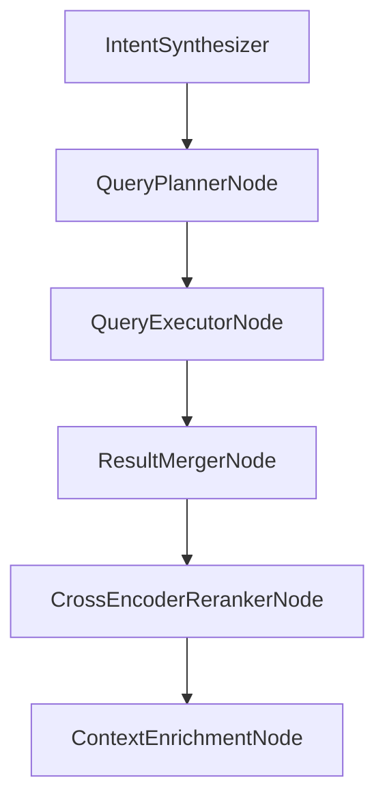

Addendum: **QueryExecutorNode** — the bridge between *plan* and *retrieval results*
Perfect — we’re now stepping into the **Query Execution Layer**, the bridge between *plan* and *retrieval results*.
At this layer, the LLM stops “planning” and our system executes the plan deterministically against real data stores — Qdrant for semantic retrieval, MongoDB for metadata filtering, and optional fusion + scoring logic.

Let’s define the **QueryExecutor schema**, **execution semantics**, and a clear **TypeScript node structure**.

---

# ⚙️ QueryExecutor Specification (v1.0)

### Purpose

The `QueryExecutorNode` takes a validated `QueryPlan` and performs actual retrieval calls to Qdrant, MongoDB, or other sources.
It returns a list of **candidates** — each representing a tool or technology with a unified metadata structure and normalized score.

---

## 📘 Candidate Object Schema

Each candidate is a unified, scored entity ready for downstream reranking.

```json
{
  "$id": "candidate.schema.json",
  "$schema": "https://json-schema.org/draft/2020-12/schema",
  "title": "Candidate",
  "description": "Represents a single retrieval result (AI tool or entity) with normalized scoring.",
  "type": "object",
  "properties": {
    "id": { "type": "string", "description": "Canonical tool ID" },
    "source": { "type": "string", "enum": ["qdrant", "mongodb", "api"] },
    "score": { "type": "number", "minimum": 0, "maximum": 1 },
    "metadata": {
      "type": "object",
      "description": "Key metadata about the tool",
      "properties": {
        "name": { "type": "string" },
        "category": { "type": "string" },
        "pricing": { "type": "string" },
        "platform": { "type": "string" },
        "features": { "type": "array", "items": { "type": "string" } },
        "description": { "type": "string" }
      }
    },
    "embeddingVector": {
      "type": ["array", "null"],
      "items": { "type": "number" },
      "description": "Optional embedding vector returned by Qdrant."
    },
    "provenance": {
      "type": "object",
      "properties": {
        "collection": { "type": "string" },
        "queryVectorSource": { "type": "string" },
        "filtersApplied": { "type": "array", "items": { "type": "string" } }
      }
    }
  },
  "required": ["id", "source", "score", "metadata"]
}
```

---

## 📘 QueryExecutor Output Schema

Each executor run returns an array of `candidates` plus meta-execution stats.

```json
{
  "$id": "query-executor-output.schema.json",
  "$schema": "https://json-schema.org/draft/2020-12/schema",
  "title": "QueryExecutorOutput",
  "type": "object",
  "properties": {
    "candidates": {
      "type": "array",
      "items": { "$ref": "candidate.schema.json" }
    },
    "executionStats": {
      "type": "object",
      "properties": {
        "vectorQueriesExecuted": { "type": "integer" },
        "structuredQueriesExecuted": { "type": "integer" },
        "fusionMethod": { "type": "string" },
        "latencyMs": { "type": "integer" }
      }
    },
    "confidence": { "type": "number", "minimum": 0, "maximum": 1 }
  },
  "required": ["candidates", "executionStats"]
}
```

---

## 🧠 Conceptual Execution Flow

```mermaid
flowchart TD
    A[QueryPlannerNode] --> B[QueryExecutorNode]
    B --> C[Qdrant Retrieval]
    B --> D[MongoDB Query]
    C --> E[Score Normalization]
    D --> E
    E --> F[Score Fusion (RRF / Weighted Sum)]
    F --> G[CandidateList]
```

**Detailed steps:**

1. Parse `QueryPlan` → identify `vectorSources` and `structuredSources`.
2. Execute Qdrant searches:

   * Use `queryVectorSource` (e.g., from reference tool or query text)
   * Retrieve topK candidates per vector source.
3. Execute MongoDB queries with filters.
4. Normalize all scores to `[0, 1]`.
5. Apply fusion strategy (`rrf`, `weighted_sum`, etc.).
6. Deduplicate candidates (same tool from multiple sources).
7. Return unified `candidates` array.

---

## 🧩 Example: Fused Candidate Output (for “Similar of Cursor IDE but cheaper”)

```json
{
  "candidates": [
    {
      "id": "trae_ide",
      "source": "fusion",
      "score": 0.91,
      "metadata": {
        "name": "Trae IDE",
        "category": "IDE",
        "pricing": "paid",
        "platform": "desktop",
        "features": ["AI code assist", "context awareness"],
        "description": "AI-native IDE with code completion and agentic workflows."
      },
      "provenance": {
        "collection": "tool_descriptions",
        "queryVectorSource": "reference_tool_embedding",
        "filtersApplied": ["pricing < cursor"]
      }
    },
    {
      "id": "github_copilot",
      "source": "fusion",
      "score": 0.87,
      "metadata": {
        "name": "GitHub Copilot",
        "category": "IDE Plugin",
        "pricing": "freemium",
        "platform": "desktop",
        "features": ["AI code assist", "extension support"],
        "description": "AI pair programmer plugin for IDEs."
      },
      "provenance": {
        "collection": "feature_docs",
        "queryVectorSource": "semantic_variant",
        "filtersApplied": []
      }
    }
  ],
  "executionStats": {
    "vectorQueriesExecuted": 2,
    "structuredQueriesExecuted": 1,
    "fusionMethod": "rrf",
    "latencyMs": 183
  },
  "confidence": 0.92
}
```

---

## ⚙️ TypeScript Node Skeleton (Implementation Outline)

```ts
import { UnifiedState } from "../types";
import { QdrantClient } from "@qdrant/js-client-rest";
import { MongoClient } from "mongodb";
import { normalizeScores, fuseResults } from "../utils/fusion";
import candidateSchema from "../schemas/candidate.schema.json";
import Ajv from "ajv";

export class QueryExecutorNode {
  name = "QueryExecutor";

  constructor(private qdrant: QdrantClient, private mongo: MongoClient) {}

  async execute(state: UnifiedState): Promise<UnifiedState> {
    const plan = state.executionPlan;
    const candidates: any[] = [];
    const start = Date.now();

    // 1. Execute vector queries
    if (plan.vectorSources?.length) {
      for (const src of plan.vectorSources) {
        const vector = await this._resolveQueryVector(state, src.queryVectorSource);
        const results = await this.qdrant.search(src.collection, {
          vector,
          limit: src.topK,
          with_payload: true
        });
        results.forEach((r: any) => {
          candidates.push({
            id: r.payload.id,
            source: "qdrant",
            score: r.score,
            metadata: r.payload,
            provenance: { collection: src.collection, queryVectorSource: src.queryVectorSource }
          });
        });
      }
    }

    // 2. Execute structured queries
    if (plan.structuredSources?.length) {
      for (const src of plan.structuredSources) {
        const db = this.mongo.db();
        const collection = db.collection(src.source.split(".")[1]);
        const filter = this._buildMongoFilter(src.filters);
        const docs = await collection.find(filter).limit(src.limit ?? 50).toArray();
        docs.forEach((doc) =>
          candidates.push({
            id: doc.id,
            source: "mongodb",
            score: 0.8, // default structured relevance baseline
            metadata: doc,
            provenance: { collection: src.source, filtersApplied: src.filters.map(f => `${f.field}${f.operator}${f.value}`) }
          })
        );
      }
    }

    // 3. Normalize & fuse
    const normalized = normalizeScores(candidates);
    const fused = fuseResults(normalized, plan.fusion ?? "rrf");

    // 4. Validate candidate shape
    const ajv = new Ajv();
    const validate = ajv.compile(candidateSchema);
    const validCandidates = fused.filter((c) => validate(c));

    state.candidates = validCandidates;
    state.executionStats = {
      vectorQueriesExecuted: plan.vectorSources?.length ?? 0,
      structuredQueriesExecuted: plan.structuredSources?.length ?? 0,
      fusionMethod: plan.fusion,
      latencyMs: Date.now() - start
    };
    return state;
  }

  async _resolveQueryVector(state: UnifiedState, source: string): Promise<number[]> {
    // Determine embedding source
    if (source === "reference_tool_embedding") {
      // Retrieve precomputed embedding from MongoDB or cache
      return state.intentState.referenceToolEmbedding;
    }
    if (source === "semantic_variant") {
      // Generate embedding from a paraphrase using your embedding model
      return await embedText(state.intentState.semanticVariants[0]);
    }
    return await embedText(state.request.query);
  }

  _buildMongoFilter(filters: any[]) {
    const f: Record<string, any> = {};
    for (const { field, operator, value } of filters) {
      switch (operator) {
        case "=": f[field] = value; break;
        case "<": f[field] = { $lt: value }; break;
        case ">": f[field] = { $gt: value }; break;
        case "contains": f[field] = { $regex: value, $options: "i" }; break;
      }
    }
    return f;
  }
}
```

---

## 🧮 Fusion Utilities (Conceptual)

```ts
export function normalizeScores(candidates: any[]) {
  const max = Math.max(...candidates.map(c => c.score));
  const min = Math.min(...candidates.map(c => c.score));
  return candidates.map(c => ({ ...c, score: (c.score - min) / (max - min) }));
}

export function fuseResults(candidates: any[], method: string) {
  if (method === "rrf") {
    const grouped = Object.values(
      candidates.reduce((acc: any, c: any) => {
        acc[c.id] = acc[c.id] || [];
        acc[c.id].push(c.score);
        return acc;
      }, {})
    );
    return grouped.map((group: any) => ({
      ...group[0],
      score: 1 / (1 + group.reduce((sum: number, s: number, i: number) => sum + 1 / (i + 1), 0))
    }));
  }
  return candidates;
}
```

---

## 🔍 Key Benefits

| Feature                    | Purpose                                                |
| -------------------------- | ------------------------------------------------------ |
| **Schema-driven results**  | Enables consistent candidate merging & evaluation      |
| **Hybrid query execution** | Combines vector & symbolic retrieval seamlessly        |
| **Pluggable fusion**       | Switch between RRF, weighted, or learned fusion easily |
| **Traceability**           | Provenance preserved for each candidate                |
| **LLM independence**       | Fully deterministic — no model required here           |

---

## 🔄 Retrieval Graph Context Summary



---

Now that the `QueryExecutorNode` and its schema are defined, our retrieval pipeline is complete up to *candidate list fusion*.
