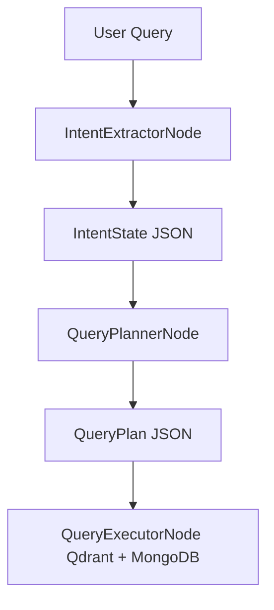

Excellent — now that we have a structured and validated **IntentState**, we can formalize the **QueryPlanner** stage.
This is the bridge between *semantic intent* and *retrieval execution*.
It converts our structured intent into a **machine-actionable plan** for Qdrant + MongoDB + optional reranking pipelines.

Below is our **production-grade QueryPlanner specification**, including JSON Schema, function-calling definition, example outputs, and TypeScript node integration template.

---

# ⚙️ QueryPlanner JSON Schema (v1.0)

Save as:

```
schemas/query-plan.schema.json
```

This schema defines how the LLM or rule-based planner expresses *how* the system should retrieve candidates given the parsed `IntentState`.

```json
{
  "$schema": "https://json-schema.org/draft/2020-12/schema",
  "$id": "query-plan.schema.json",
  "title": "QueryPlan",
  "description": "Structured retrieval plan generated from IntentState, guiding how to query hybrid data sources (Qdrant, MongoDB, APIs).",
  "type": "object",
  "properties": {
    "strategy": {
      "type": "string",
      "enum": ["hybrid", "multi-vector", "vector-only", "metadata-only", "semantic-kg"],
      "description": "High-level retrieval mode to use based on intent complexity and filters."
    },
    "vectorSources": {
      "type": "array",
      "description": "List of vector collections and embedding types to query (e.g., 'tool_descriptions', 'feature_docs').",
      "items": {
        "type": "object",
        "properties": {
          "collection": { "type": "string" },
          "embeddingType": { "type": "string" },
          "queryVectorSource": { "type": "string", "enum": ["query_text", "reference_tool_embedding", "semantic_variant"] },
          "topK": { "type": "integer", "minimum": 1, "maximum": 200 }
        },
        "required": ["collection", "embeddingType", "queryVectorSource", "topK"]
      }
    },
    "structuredSources": {
      "type": "array",
      "description": "Structured databases or APIs with filters to apply (MongoDB, PostgreSQL, REST API).",
      "items": {
        "type": "object",
        "properties": {
          "source": { "type": "string" },
          "filters": {
            "type": "array",
            "items": {
              "type": "object",
              "properties": {
                "field": { "type": "string" },
                "operator": { "type": "string" },
                "value": {}
              },
              "required": ["field", "operator", "value"]
            }
          },
          "limit": { "type": "integer", "minimum": 1, "maximum": 200 }
        },
        "required": ["source"]
      }
    },
    "reranker": {
      "type": "object",
      "description": "Optional reranking strategy configuration.",
      "properties": {
        "type": { "type": "string", "enum": ["cross-encoder", "LTR", "none"] },
        "model": { "type": "string" },
        "maxCandidates": { "type": "integer" }
      }
    },
    "fusion": {
      "type": "string",
      "enum": ["rrf", "weighted_sum", "concat", "none"],
      "description": "Fusion method for combining scores across sources."
    },
    "maxRefinementCycles": {
      "type": "integer",
      "minimum": 0,
      "maximum": 5,
      "description": "How many refinement iterations to allow if low confidence."
    },
    "explanation": {
      "type": "string",
      "description": "Natural-language rationale for why this plan is suitable for the given intent."
    },
    "confidence": {
      "type": "number",
      "minimum": 0,
      "maximum": 1
    }
  },
  "required": ["strategy", "confidence"],
  "additionalProperties": false
}
```

---

# 🤖 LLM Function-Calling Schema (OpenAI / Gemini-compatible)

```json
{
  "name": "plan_retrieval_strategy",
  "description": "Plans the optimal hybrid retrieval strategy for Qdrant and MongoDB based on the given IntentState.",
  "parameters": {
    "type": "object",
    "properties": {
      "strategy": {
        "type": "string",
        "enum": ["hybrid", "multi-vector", "vector-only", "metadata-only", "semantic-kg"]
      },
      "vectorSources": {
        "type": "array",
        "items": {
          "type": "object",
          "properties": {
            "collection": { "type": "string" },
            "embeddingType": { "type": "string" },
            "queryVectorSource": { "type": "string" },
            "topK": { "type": "integer" }
          }
        }
      },
      "structuredSources": {
        "type": "array",
        "items": {
          "type": "object",
          "properties": {
            "source": { "type": "string" },
            "filters": { "type": "array", "items": { "type": "object" } },
            "limit": { "type": "integer" }
          }
        }
      },
      "reranker": {
        "type": "object",
        "properties": {
          "type": { "type": "string" },
          "model": { "type": "string" },
          "maxCandidates": { "type": "integer" }
        }
      },
      "fusion": { "type": "string" },
      "maxRefinementCycles": { "type": "integer" },
      "explanation": { "type": "string" },
      "confidence": { "type": "number" }
    },
    "required": ["strategy", "confidence"]
  }
}
```

---

# 🧩 System Prompt for the QueryPlanner LLM

> You are an AI Retrieval Planner for an agentic search engine specialized in AI tools and technologies.
> You receive a structured `IntentState` object that describes the user’s goal, features, pricing, and comparison intent.
> You must design an optimal `QueryPlan` JSON according to the schema.
> Combine vector-based similarity (Qdrant) with metadata filters (MongoDB) where appropriate.
> Provide reasoning in `explanation`.
> Do not exceed topK=200.
> If unsure, prefer `hybrid` strategy and RRF fusion.

---

# 🧪 Example — QueryPlan Outputs

### Example 1 — “Similar of Cursor IDE but cheaper”

```json
{
  "strategy": "hybrid",
  "vectorSources": [
    {
      "collection": "tool_descriptions",
      "embeddingType": "text-embedding-3-large",
      "queryVectorSource": "reference_tool_embedding",
      "topK": 50
    },
    {
      "collection": "feature_docs",
      "embeddingType": "text-embedding-3-small",
      "queryVectorSource": "semantic_variant",
      "topK": 30
    }
  ],
  "structuredSources": [
    {
      "source": "mongodb.ai_tools",
      "filters": [
        { "field": "category", "operator": "=", "value": "IDE" },
        { "field": "pricing.value", "operator": "<", "value": "Cursor IDE" }
      ],
      "limit": 100
    }
  ],
  "reranker": {
    "type": "cross-encoder",
    "model": "bge-reranker-large",
    "maxCandidates": 100
  },
  "fusion": "rrf",
  "maxRefinementCycles": 2,
  "explanation": "The query is comparative ('similar_to' Cursor IDE). Use Cursor's embedding to retrieve similar IDEs from Qdrant. Apply MongoDB filters for cheaper pricing. Combine and rerank using cross-encoder.",
  "confidence": 0.93
}
```

---

### Example 2 — “Free CLI”

```json
{
  "strategy": "hybrid",
  "vectorSources": [
    {
      "collection": "tool_descriptions",
      "embeddingType": "text-embedding-3-large",
      "queryVectorSource": "query_text",
      "topK": 60
    }
  ],
  "structuredSources": [
    {
      "source": "mongodb.ai_tools",
      "filters": [
        { "field": "platform", "operator": "=", "value": "cli" },
        { "field": "pricing", "operator": "=", "value": "free" }
      ],
      "limit": 60
    }
  ],
  "reranker": {
    "type": "none"
  },
  "fusion": "weighted_sum",
  "maxRefinementCycles": 1,
  "explanation": "A simple discovery query emphasizing free CLI tools. Combine lightweight Qdrant search with direct MongoDB filters for pricing and platform.",
  "confidence": 0.89
}
```

---

# 🧠 Integration Flow

1. **Input:** `IntentState` (produced by IntentExtractorNode)
2. **Process:** The `QueryPlannerNode` sends that structured state to the LLM (or a local ruleset).
3. **Output:** Validated `QueryPlan` stored in `state.executionPlan`.

---

# 🧩 TypeScript Node Skeleton

Save as `src/nodes/query-planner.node.ts`:

```ts
import { UnifiedState } from "../types";
import schema from "../schemas/query-plan.schema.json";
import Ajv from "ajv";
import { openai } from "../clients/openai"; // your OpenAI client wrapper

export class QueryPlannerNode {
  name = "QueryPlanner";

  async execute(state: UnifiedState): Promise<UnifiedState> {
    const intent = state.intentState;
    const completion = await openai.chat.completions.create({
      model: "gpt-4o",
      messages: [
        {
          role: "system",
          content:
            "You are a Query Planner that translates structured IntentState into a retrieval plan JSON. Follow the schema strictly."
        },
        {
          role: "user",
          content: `IntentState:\n${JSON.stringify(intent, null, 2)}`
        }
      ],
      functions: [plan_retrieval_strategy],
      function_call: { name: "plan_retrieval_strategy" }
    });

    const args = JSON.parse(completion.choices[0].message.function_call.arguments);

    const ajv = new Ajv();
    const validate = ajv.compile(schema);
    if (!validate(args)) throw new Error("QueryPlan validation failed");

    state.executionPlan = args;
    return state;
  }
}
```

---

# 🧩 Why This Design Is Strong

| Concept                   | Role                                                       |
| ------------------------- | ---------------------------------------------------------- |
| **LLM-planned retrieval** | Adaptive, context-aware retrieval plan selection           |
| **Schema validation**     | Enforces reproducible, auditable reasoning                 |
| **Hybrid structure**      | Combines vector (semantic) + symbolic (filters) retrieval  |
| **Explainability**        | Each plan includes a natural-language explanation          |
| **Confidence-aware**      | Enables downstream Policy Graph to decide whether to rerun |

---

# 🔄 Data Flow Summary (Intent → Planner → Executor)



