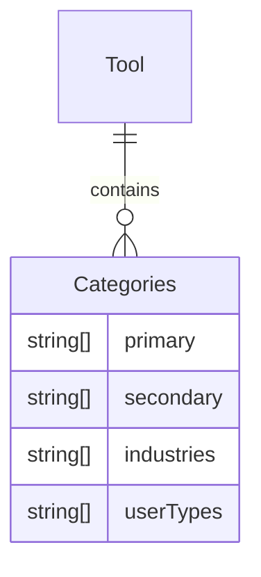
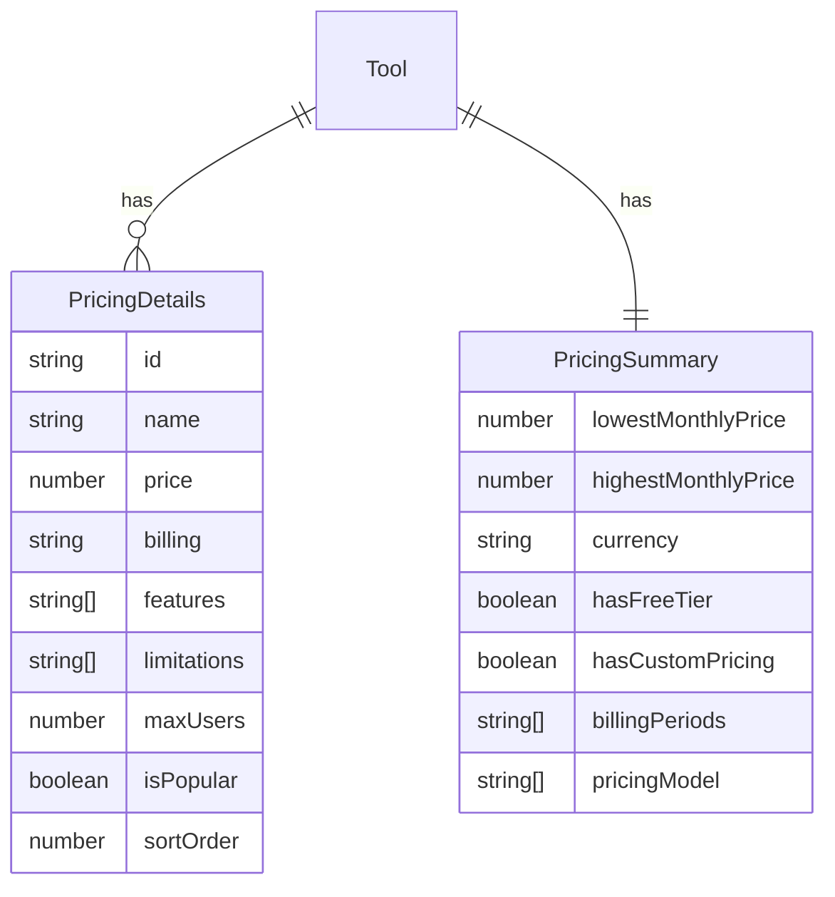
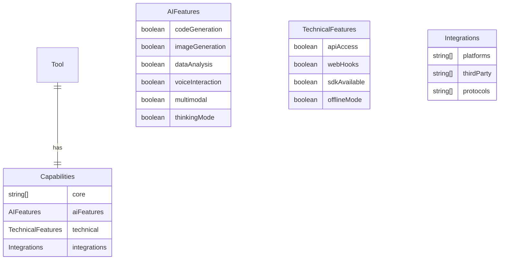
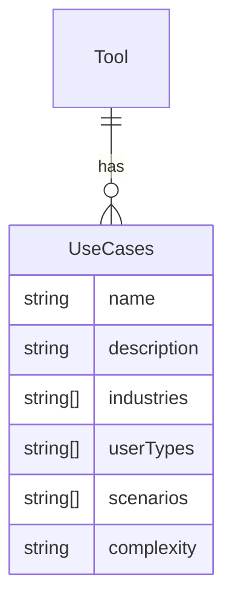

# Tools Data Model v2.0

## Entity Relationship Overview

### Core Entities

```
ToolsDatabase
├── metadata (version, schema, lastUpdated)
└── tools[] (Tool)
    ├── identity (id, name, slug, description, longDescription, tagline)
    ├── categorization (categories)
    ├── pricing (pricingSummary, pricingDetails)
    ├── capabilities (core, aiFeatures, technical, integrations)
    ├── useCases[]
    ├── searchOptimization (searchKeywords, semanticTags, aliases)
    └── metadata (logoUrl, website, pricingUrl, documentation, status, contributor, dates)
```

## Detailed Entity Relationships

### 1. Tool Entity (Primary)

The Tool entity is the central object that contains all information about a specific tool.

**Relationships:**
- One-to-many with PricingDetails (tool has multiple pricing plans)
- One-to-many with UseCases (tool has multiple use cases)
- One-to-one with all other nested objects

**Key Constraints:**
- `id` must be unique across all tools
- `slug` must be URL-friendly and unique
- `status` must be one of: active, beta, deprecated, discontinued

### 2. Categories Entity



**Business Rules:**
- `primary` categories must have at least one entry
- `industries` and `userTypes` must have at least one entry each
- `secondary` categories are optional but recommended for better classification

### 3. Pricing Structure



**Business Rules:**
- `lowestMonthlyPrice` cannot exceed `highestMonthlyPrice`
- `currency` must be valid ISO 4217 code
- `pricingDetails` must have at least one entry
- `sortOrder` must be unique within a tool's pricing plans
- `pricingModel` is now an array to support multiple models

### 4. Capabilities Structure



**Business Rules:**
- `core` capabilities must have at least one entry
- All boolean flags in `aiFeatures` and `technical` must be explicitly set
- `platforms` must include at least one supported platform
- Added `thinkingMode` to AI features

### 5. Use Cases Entity



**Business Rules:**
- `complexity` must be one of: beginner, intermediate, advanced
- `industries` and `userTypes` arrays cannot be empty
- `scenarios` should provide specific usage examples
- Each use case must have a unique `name` within the tool

## Field-by-Field Documentation

### Identity Fields

#### id
- **Type**: string
- **Format**: Lowercase, hyphen-separated, alphanumeric
- **Validation**: Unique across all tools, regex `^[a-z0-9-]+$`
- **Example**: "chatgpt", "github-copilot"
- **Usage**: Primary key, API references, database lookups

#### name
- **Type**: string
- **Format**: Title case, can include spaces and special characters
- **Validation**: 1-100 characters, cannot be empty
- **Example**: "ChatGPT", "GitHub Copilot"
- **Usage**: Display name, search indexing, user interface

#### slug
- **Type**: string
- **Format**: URL-friendly, lowercase, hyphens instead of spaces
- **Validation**: Unique across all tools, regex `^[a-z0-9-]+$`
- **Example**: "chatgpt", "github-copilot"
- **Usage**: SEO-friendly URLs, routing, references

#### description
- **Type**: string
- **Format**: Plain text, no HTML
- **Validation**: 10-200 characters, meaningful content
- **Example**: "Advanced AI chatbot for natural conversations"
- **Usage**: Search snippets, card displays, quick overviews

#### longDescription
- **Type**: string
- **Format**: Plain text or Markdown, can include line breaks
- **Validation**: 50-2000 characters, comprehensive content
- **Example**: "ChatGPT is an advanced language model developed by OpenAI..."
- **Usage**: Detail pages, full descriptions, RAG context

#### tagline
- **Type**: string
- **Format**: Short, catchy phrase
- **Validation**: 0-100 characters, optional
- **Example**: "Your AI conversation partner"
- **Usage**: Marketing materials, headers, branding

### Categorization Fields

#### categories.primary
- **Type**: string[]
- **Format**: Array of category names
- **Validation**: 1-5 entries, predefined categories only
- **Allowed Values**: "AI", "Chatbot", "Development", "Productivity", etc.
- **Usage**: Main classification, filtering, navigation

#### categories.secondary
- **Type**: string[]
- **Format**: Array of category names
- **Validation**: 0-5 entries, predefined categories only
- **Allowed Values**: Same as primary categories
- **Usage**: Additional classification, cross-referencing

#### categories.industries
- **Type**: string[]
- **Format**: Array of industry names
- **Validation**: 1-10 entries, standardized industry names
- **Allowed Values**: "Technology", "Healthcare", "Finance", "Education", etc.
- **Usage**: Industry-specific filtering, B2B targeting

#### categories.userTypes
- **Type**: string[]
- **Format**: Array of user type names
- **Validation**: 1-10 entries, standardized user types
- **Allowed Values**: "Developers", "Designers", "Marketers", "Students", etc.
- **Usage**: User persona targeting, personalized recommendations

### Pricing Fields

#### pricingSummary.lowestMonthlyPrice
- **Type**: number
- **Format**: Decimal, two decimal places maximum
- **Validation**: >= 0, <= highestMonthlyPrice
- **Example**: 0, 9.99, 29.99
- **Usage**: Price range filtering, comparison, sorting

#### pricingSummary.highestMonthlyPrice
- **Type**: number
- **Format**: Decimal, two decimal places maximum
- **Validation**: >= lowestMonthlyPrice
- **Example**: 0, 19.99, 99.99
- **Usage**: Price range filtering, comparison, sorting

#### pricingSummary.currency
- **Type**: string
- **Format**: ISO 4217 currency code
- **Validation**: 3 uppercase letters, valid currency code
- **Example**: "USD", "EUR", "GBP"
- **Usage**: Currency conversion, display formatting

#### pricingSummary.hasFreeTier
- **Type**: boolean
- **Format**: true/false
- **Validation**: Must match pricingDetails data
- **Usage**: Free tier filtering, quick identification

#### pricingSummary.hasCustomPricing
- **Type**: boolean
- **Format**: true/false
- **Validation**: Reflects enterprise pricing availability
- **Usage**: Enterprise filtering, sales processes

#### pricingSummary.billingPeriods
- **Type**: string[]
- **Format**: Array of billing period names
- **Validation**: 1-3 entries, predefined values
- **Allowed Values**: "month", "year", "week", "day"
- **Usage**: Billing options display, filtering

#### pricingSummary.pricingModel
- **Type**: string[]
- **Format**: Array of pricing model identifiers
- **Validation**: Predefined values only
- **Allowed Values**: "subscription", "one-time", "freemium", "usage-based", "token based", "custom"
- **Usage**: Business model categorization, filtering

#### pricingDetails[]
- **Type**: array of objects
- **Validation**: 1-10 entries, all required fields present
- **Usage**: Detailed pricing information, plan comparison

### Capabilities Fields

#### capabilities.core
- **Type**: string[]
- **Format**: Array of core functionality names
- **Validation**: 1-10 entries, standardized capability names
- **Allowed Values**: "Text Generation", "Code Generation", "Data Analysis", etc.
- **Usage**: Feature filtering, capability search, comparison

#### capabilities.aiFeatures
- **Type**: object with boolean properties
- **Validation**: All properties must be explicitly set
- **Properties**: codeGeneration, imageGeneration, dataAnalysis, voiceInteraction, multimodal, thinkingMode
- **Usage**: AI-specific feature filtering, technical comparison

#### capabilities.technical
- **Type**: object with boolean properties
- **Validation**: All properties must be explicitly set
- **Properties**: apiAccess, webHooks, sdkAvailable, offlineMode
- **Usage**: Technical requirement filtering, integration planning

#### capabilities.integrations
- **Type**: object with array properties
- **Validation**: All arrays must have at least one entry
- **Properties**: platforms, thirdParty, protocols
- **Usage**: Integration compatibility, ecosystem planning

### Use Cases Fields

#### useCases[].name
- **Type**: string
- **Format**: Title case, descriptive name
- **Validation**: 1-50 characters, unique within tool
- **Example**: "Writing assistance", "Code help"
- **Usage**: Use case identification, filtering, organization

#### useCases[].description
- **Type**: string
- **Format**: Detailed description
- **Validation**: 10-500 characters, meaningful content
- **Example**: "Help with content creation, editing, and optimization"
- **Usage**: Use case understanding, RAG context

#### useCases[].industries
- **Type**: string[]
- **Format**: Array of industry names
- **Validation**: 1-5 entries, standardized industry names
- **Usage**: Industry-specific use case filtering

#### useCases[].userTypes
- **Type**: string[]
- **Format**: Array of user type names
- **Validation**: 1-5 entries, standardized user types
- **Usage**: User-specific use case filtering

#### useCases[].scenarios
- **Type**: string[]
- **Format**: Array of specific usage scenarios
- **Validation**: 1-10 entries, concrete examples
- **Example**: ["Blog writing", "Email drafting", "Academic papers"]
- **Usage**: Scenario-based search, practical applications

#### useCases[].complexity
- **Type**: string
- **Format**: Single complexity level
- **Validation**: Predefined values only
- **Allowed Values**: "beginner", "intermediate", "advanced"
- **Usage**: Skill-based filtering, user guidance

### Search Optimization Fields

#### searchKeywords
- **Type**: string[]
- **Format**: Array of keywords and phrases
- **Validation**: 5-20 entries, lowercase, no duplicates
- **Example**: ["chatbot", "ai", "conversation", "gpt"]
- **Usage**: Keyword search, SEO, discovery

#### semanticTags
- **Type**: string[]
- **Format**: Array of semantic tags
- **Validation**: 5-20 entries, standardized tags
- **Example**: ["natural language processing", "machine learning"]
- **Usage**: Semantic search, AI understanding, context

#### aliases
- **Type**: string[]
- **Format**: Array of alternative names
- **Validation**: 0-10 entries, common variations
- **Example**: ["OpenAI ChatGPT", "GPT-4", "Chat GPT"]
- **Usage**: Search expansion, user flexibility

### Metadata Fields

#### logoUrl
- **Type**: string
- **Format**: Valid URL
- **Validation**: Must be accessible URL, optional
- **Example**: "https://example.com/chatgpt-logo.png"
- **Usage**: Branding, visual identification

#### website
- **Type**: string
- **Format**: Valid URL
- **Validation**: Must be accessible URL, optional
- **Example**: "https://chat.openai.com"
- **Usage**: External links, reference, verification

#### pricingUrl
- **Type**: string
- **Format**: Valid URL
- **Validation**: Must be accessible URL, optional
- **Example**: "https://chatgpt.com/pricing"
- **Usage**: Direct link to pricing information

#### documentation
- **Type**: string
- **Format**: Valid URL
- **Validation**: Must be accessible URL, optional
- **Example**: "https://platform.openai.com/docs"
- **Usage**: Technical reference, API documentation

#### status
- **Type**: string
- **Format**: Single status identifier
- **Validation**: Predefined values only
- **Allowed Values**: "active", "beta", "deprecated", "discontinued"
- **Usage**: Availability filtering, lifecycle management

#### contributor
- **Type**: string
- **Format**: Contributor identifier
- **Validation**: Non-empty string
- **Example**: "system", "user123", "admin"
- **Usage**: Data provenance, attribution

#### dateAdded
- **Type**: string
- **Format**: ISO 8601 datetime
- **Validation**: Valid datetime format
- **Example**: "2025-09-14T08:40:00Z"
- **Usage**: Sorting, filtering, analytics

#### lastUpdated
- **Type**: string
- **Format**: ISO 8601 datetime
- **Validation**: Valid datetime format
- **Example**: "2025-09-14T08:40:00Z"
- **Usage**: Freshness indication, sorting, caching

## Data Integrity Constraints

### Unique Constraints
- `id` must be globally unique across all tools
- `slug` must be globally unique across all tools
- `pricingDetails[].id` must be unique within each tool
- `useCases[].name` must be unique within each tool

### Referential Integrity
- All URLs must be accessible and return valid content
- Currency codes must be valid ISO 4217 codes
- Language codes must be valid ISO 639-1 codes

### Data Validation Rules
- All required fields must be present and non-empty
- Array fields must have the minimum required number of entries
- Numeric fields must be within specified ranges
- Enum fields must contain only allowed values
- Date fields must be valid ISO 8601 format

### Business Logic Constraints
- `pricingSummary.lowestMonthlyPrice` <= `pricingSummary.highestMonthlyPrice`
- `pricingSummary.hasFreeTier` must be consistent with `pricingDetails`

## Indexing Strategy

### Primary Indexes
- **tools.id**: Unique index for primary key lookups
- **tools.slug**: Unique index for URL-based lookups
- **tools.status**: Index for status-based filtering

### Secondary Indexes
- **tools.categories.primary**: Index for primary category filtering
- **tools.categories.industries**: Index for industry-based filtering
- **tools.categories.userTypes**: Index for user type filtering
- **tools.pricingSummary.hasFreeTier**: Index for free tier filtering
- **tools.capabilities.aiFeatures**: Index for AI feature filtering

### Full-Text Search Indexes
- **tools.searchKeywords**: Full-text index for keyword search
- **tools.semanticTags**: Full-text index for semantic search
- **tools.aliases**: Full-text index for alternative name search
- **tools.description**: Full-text index for description search
- **tools.longDescription**: Full-text index for detailed content search

## Schema Evolution

### Version 2.0 Changes
- Simplified structure by removing technicalSpecs, metrics, comparison, and ragOptimization entities
- Added `longDescription` and `tagline` to identity fields
- Changed `pricingModel` from string to array to support multiple models
- Added `thinkingMode` to AI features
- Added `pricingUrl` to metadata fields
- Removed `annualDiscount` from pricing details

### Migration Strategy
- Existing data should be migrated to remove obsolete fields
- New fields should be populated with appropriate default values
- Validation rules should be updated to match new constraints

### Composite Indexes
- **(status, popularity)**: For active tools sorted by popularity
- **(categories.primary, rating)**: For category-based filtering with sorting
- **(pricingSummary.hasFreeTier, metrics.popularity)**: For free tools sorted by popularity
- **(rag.contextWeight, searchRelevance)**: For RAG-optimized queries

## Performance Considerations

### Query Optimization
- Use appropriate indexes for common query patterns
- Implement pagination for large result sets
- Cache frequently accessed tools and metadata
- Use materialized views for complex aggregations

### Storage Optimization
- Use appropriate data types for each field
- Consider compression for large text fields
- Implement data archiving for deprecated tools
- Use partitioning for large datasets

### Caching Strategy
- Cache tool metadata with TTL-based expiration
- Cache search results for common queries
- Implement cache invalidation on tool updates
- Use CDN for static assets like logos

## Migration Considerations

### Schema Migration
- Plan for zero-downtime migration
- Implement backward compatibility during transition
- Create migration scripts for data transformation
- Test migration with sample data before production

### Data Migration
- Preserve all existing data during migration
- Enrich data with new fields where possible
- Validate data integrity after migration
- Implement rollback procedures

### Application Migration
- Update API endpoints to handle new schema
- Modify frontend components to use new structure
- Update search indexing to include new fields
- Implement RAG optimization features

This data model provides a comprehensive foundation for the enhanced tools database, supporting advanced search capabilities, filtering, comparison, and RAG optimization while maintaining data integrity and performance.
