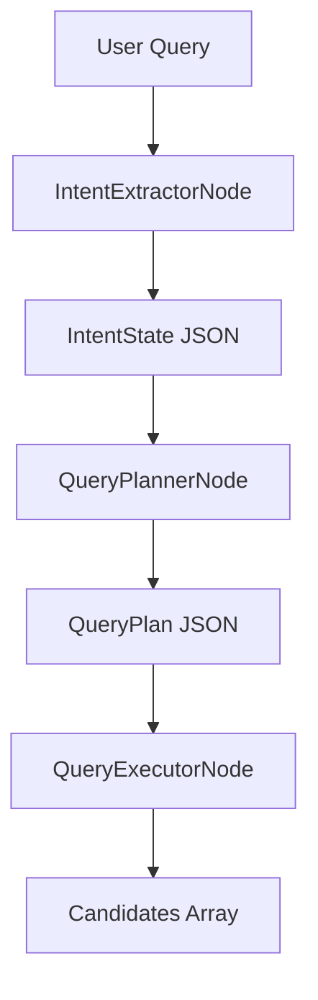

# Complete Agentic Search System Refactoring Specification

## 📋 Executive Summary

**Objective**: Transform the existing 13-node intent extraction pipeline into a modern, LLM-first agentic search architecture for AI tools and technology discovery.

**Current Problem**: The search-api currently uses a complex, rule-based extraction system with 13+ sequential nodes that creates maintenance nightmares, performance issues, and limited extensibility.

**Solution**: Replace the entire pipeline with 3 focused nodes using LLM-based natural language understanding and schema-driven validation.

**Expected Benefits**:
- **80% reduction** in codebase complexity (13+ nodes → 3 nodes)
- **Faster execution** with fewer processing steps
- **Better maintainability** and easier extensibility
- **Modern architecture** using LLM-first design patterns
- **Type safety** with schema validation at each step

---

## 🔍 Current Architecture Analysis

### Existing Structure (Problems)

```
search-api/src/nodes/
├── extraction/                    # 13 complex nodes
│   ├── semantic-prefilter.node.ts
│   ├── zero-shot-classifier.node.ts
│   ├── ner-extractor.node.ts
│   ├── fuzzy-matcher.node.ts
│   ├── name-resolver.node.ts
│   ├── comparative-detector.node.ts
│   ├── reference-extractor.node.ts
│   ├── price-extractor.node.ts
│   ├── interface-detector.node.ts
│   ├── deployment-detector.node.ts
│   ├── intent-synthesizer.node.ts
│   └── score-combiner.node.ts
├── planning/                      # 4 planning nodes
└── execution/                     # 3 execution nodes
```

**Key Issues**:
- **Over-engineered complexity**: 13 extraction nodes doing what 1 LLM node could handle
- **Maintenance nightmare**: 20+ files with complex dependencies
- **Performance issues**: Sequential processing through multiple nodes
- **Hard to extend**: Adding new capabilities requires modifying multiple nodes
- **Rule-based limitations**: Hardcoded logic vs. natural language understanding

### Current State Schema
```typescript
// Complex state with 30+ annotation fields
interface StateAnnotation {
  // Multiple extraction signals
  toolNames: Annotation<string[]>;
  entities: Annotation<Entity[]>;
  confidence: Annotation<number>;

  // Complex routing and quality assessment
  adaptiveRouting: Annotation<any>;
  qualityAssessment: Annotation<any>;

  // Extensive metadata tracking
  iterationControl: Annotation<any>;
  executionStats: Annotation<any>;
  // ... 20+ more fields
}
```

---

## 🎯 New Architecture Design

### 3-Node LLM-First Pipeline



### Core Components

#### 1. IntentExtractorNode (LLM-based)
- **Input**: Raw user query
- **Output**: Structured `IntentState` JSON
- **Purpose**: Understand user's goal, extract features, pricing, comparison mode
- **Technology**: LangChain + OpenAI-compatible API with function calling

#### 2. QueryPlannerNode (LLM-based)
- **Input**: `IntentState` JSON
- **Output**: `QueryPlan` JSON
- **Purpose**: Convert intent into actionable retrieval strategy
- **Technology**: LangChain + OpenAI-compatible API with function calling

#### 3. QueryExecutorNode (Deterministic)
- **Input**: `QueryPlan` JSON
- **Output**: `Candidates` array
- **Purpose**: Execute vector searches (Qdrant) and metadata queries (MongoDB)
- **Technology**: Qdrant client + MongoDB aggregation pipelines

### New State Schema
```typescript
interface NewStateAnnotation {
  query: Annotation<string>;
  intentState: Annotation<IntentState | null>;
  executionPlan: Annotation<QueryPlan | null>;
  candidates: Annotation<Candidate[]>;
  executionStats: Annotation<ExecutionStats>;
  metadata: Annotation<any>;
  errors: Annotation<Error[]>;
}
```

---

## 📁 Target File Structure

```
src/
├── schemas/                          # New: JSON schema definitions
│   ├── intent-state.schema.json     # IntentState validation
│   ├── query-plan.schema.json       # QueryPlan validation
│   └── candidate.schema.json        # Candidate validation
├── types/                           # New: TypeScript interfaces
│   ├── intent-state.ts              # IntentState type
│   ├── query-plan.ts                # QueryPlan type
│   └── candidate.ts                 # Candidate type
├── nodes/                           # Refactored: 3 core nodes
│   ├── intent-extractor.node.ts     # LLM-based intent extraction
│   ├── query-planner.node.ts        # LLM-based query planning
│   ├── query-executor.node.ts       # Deterministic execution
│   └── intent-extraction.node.ts    # Simplified orchestrator
├── utils/                           # New: Utility functions
│   └── fusion.ts                     # Score merging (RRF, weighted sum)
└── nodes/_archived_extraction/      # Archive: Old extraction nodes
    ├── preprocessing/
    ├── extraction/                  # All 13 old nodes moved here
    └── planning/
```

---

## 📋 Sequential Task Breakdown

### Phase 1: Foundation (Schemas & Types) - 30 minutes

#### T001: Create Intent State Schema
**File**: `src/schemas/intent-state.schema.json`
**Description**: Create JSON schema for structured intent representation
**Dependencies**: None
**Estimated Time**: 10 minutes
**Acceptance Criteria**:
- JSON schema validates correctly
- Covers all intent fields (primaryGoal, referenceTool, pricing, etc.)
- Includes proper enum constraints and validation rules

#### T002: Create Query Plan Schema
**File**: `src/schemas/query-plan.schema.json`
**Description**: Create JSON schema for retrieval strategy planning
**Dependencies**: T001
**Estimated Time**: 10 minutes
**Acceptance Criteria**:
- Supports hybrid, vector-only, metadata-only strategies
- Includes vector sources and structured sources configuration
- Validates fusion and reranking options

#### T003: Create Candidate Schema
**File**: `src/schemas/candidate.schema.json`
**Description**: Create JSON schema for search result candidates
**Dependencies**: T002
**Estimated Time**: 5 minutes
**Acceptance Criteria**:
- Defines candidate structure with metadata and scoring
- Supports multiple source types (qdrant, mongodb, api, fusion)
- Includes provenance tracking

#### T004: Create TypeScript Types
**Files**:
- `src/types/intent-state.ts`
- `src/types/query-plan.ts`
- `src/types/candidate.ts`
**Description**: Generate TypeScript interfaces from JSON schemas
**Dependencies**: T003
**Estimated Time**: 5 minutes
**Acceptance Criteria**:
- All types match JSON schemas exactly
- Proper enum handling and null safety
- Export statements correctly configured

### Phase 2: Core Nodes Implementation - 3-4 hours

#### T005: Implement IntentExtractorNode
**File**: `src/nodes/intent-extractor.node.ts`
**Description**: LLM-based intent extraction using function calling
**Dependencies**: T004
**Estimated Time**: 1.5-2 hours
**Acceptance Criteria**:
- Uses LangChain with OpenAI-compatible API
- Validates output against intent-state schema
- Handles all query types (simple, comparative, complex)
- Proper error handling and logging

#### T006: Implement QueryPlannerNode
**File**: `src/nodes/query-planner.node.ts`
**Description**: LLM-based retrieval strategy planning
**Dependencies**: T005
**Estimated Time**: 1.5-2 hours
**Acceptance Criteria**:
- Creates optimal hybrid retrieval strategies
- Supports multiple vector sources and query types
- Includes intelligent fusion method selection
- Validates against query-plan schema

#### T007: Implement QueryExecutorNode
**File**: `src/nodes/query-executor.node.ts`
**Description**: Deterministic execution against Qdrant and MongoDB
**Dependencies**: T006
**Estimated Time**: 1-1.5 hours
**Acceptance Criteria**:
- Executes vector searches against Qdrant
- Runs structured queries against MongoDB
- Implements score normalization
- Handles multiple query strategies

#### T008: Implement Fusion Utilities
**File**: `src/utils/fusion.ts`
**Description**: Score merging algorithms (RRF, weighted sum)
**Dependencies**: T007
**Estimated Time**: 30-45 minutes
**Acceptance Criteria**:
- Implements Reciprocal Rank Fusion (RRF)
- Implements weighted sum fusion
- Supports concat (no fusion) option
- Proper score normalization

### Phase 3: Integration & Migration - 1 hour

#### T009: Update State Definition
**File**: `src/types/state.ts`
**Description**: Update StateAnnotation with new schema
**Dependencies**: T008
**Estimated Time**: 15 minutes
**Acceptance Criteria**:
- Replaces old extraction fields with new schema
- Maintains compatibility with existing graphs
- Proper type annotations

#### T010: Simplify Intent Extraction Orchestrator
**File**: `src/nodes/intent-extraction.node.ts`
**Description**: Replace 13-node pipeline with 3-node pipeline
**Dependencies**: T009
**Estimated Time**: 20 minutes
**Acceptance Criteria**:
- Sequential execution through 3 nodes
- Proper error handling and metadata tracking
- Maintains existing API contract

#### T011: Archive Old Extraction Nodes
**Directory**: `src/nodes/_archived_extraction/`
**Description**: Move all old extraction nodes to archive
**Dependencies**: T010
**Estimated Time**: 10 minutes
**Acceptance Criteria**:
- All 13 extraction nodes moved to archive
- Preserve directory structure for reference
- No breaking imports remaining

#### T012: Update Graph Definitions
**Files**:
- `src/graphs/intent-extraction.graph.ts`
- `src/graphs/query-planning.graph.ts`
- `src/graphs/execution.graph.ts`
**Description**: Update graphs to use new node structure
**Dependencies**: T011
**Estimated Time**: 15 minutes
**Acceptance Criteria**:
- Graphs use simplified 3-node structure
- Maintain existing graph contracts
- Proper error handling and checkpointing

### Phase 4: Testing & Validation - 2 hours

#### T013: Create Schema Validation Tests
**File**: `src/tests/schema-validation.test.ts`
**Description**: Test JSON schema validation for all types
**Dependencies**: T012
**Estimated Time**: 20 minutes
**Acceptance Criteria**:
- Valid schemas pass validation
- Invalid schemas are rejected appropriately
- Comprehensive edge case coverage

#### T014: Create IntentExtractor Tests
**File**: `src/tests/intent-extractor.test.ts`
**Description**: Unit tests for intent extraction node
**Dependencies**: T013
**Estimated Time**: 30 minutes
**Acceptance Criteria**:
- Test all query types and edge cases
- Validate schema compliance
- Mock LLM responses appropriately

#### T015: Create QueryPlanner Tests
**File**: `src/tests/query-planner.test.ts`
**Description**: Unit tests for query planning node
**Dependencies**: T014
**Estimated Time**: 30 minutes
**Acceptance Criteria**:
- Test various intent types and strategies
- Validate plan structure and logic
- Mock LLM responses appropriately

#### T016: Create QueryExecutor Tests
**File**: `src/tests/query-executor.test.ts`
**Description**: Unit tests for query execution node
**Dependencies**: T015
**Estimated Time**: 20 minutes
**Acceptance Criteria**:
- Test vector and structured query execution
- Validate score normalization and fusion
- Mock database responses appropriately

#### T017: Create End-to-End Pipeline Tests
**File**: `src/tests/e2e-pipeline.test.ts`
**Description**: Integration tests for complete pipeline
**Dependencies**: T016
**Estimated Time**: 20 minutes
**Acceptance Criteria**:
- Test complete query flow: Input → Intent → Plan → Candidates
- Validate results quality and structure
- Performance benchmarks

#### T018: Create Debug Scripts
**File**: `src/debug-scripts/test-refactored-pipeline.ts`
**Description**: Debug script for testing new pipeline
**Dependencies**: T017
**Estimated Time**: 20 minutes
**Acceptance Criteria**:
- Interactive testing interface
- Detailed logging at each step
- Performance metrics collection

#### T019: Performance Benchmarking
**File**: `src/debug-scripts/performance-comparison.ts`
**Description**: Compare old vs new pipeline performance
**Dependencies**: T018
**Estimated Time**: 20 minutes
**Acceptance Criteria**:
- Response time measurements
- Memory usage comparison
- Throughput analysis

#### T020: Final Integration Validation
**File**: `src/debug-scripts/complete-validation.ts`
**Description**: Comprehensive validation of refactored system
**Dependencies**: T019
**Estimated Time**: 20 minutes
**Acceptance Criteria**:
- All functionality working correctly
- Performance meets expectations
- No regressions detected

---

## ⏱️ Implementation Timeline

### Total Estimated Time: 6-8 hours

- **Phase 1 (Foundation)**: 30 minutes
- **Phase 2 (Core Nodes)**: 3-4 hours
- **Phase 3 (Integration)**: 1 hour
- **Phase 4 (Testing)**: 2 hours

### Daily Breakdown
- **Day 1**: Complete Phase 1-2 (4-5 hours)
- **Day 2**: Complete Phase 3-4 (3-4 hours)

### Checkpoints
- **Checkpoint 1** (after T004): Foundation complete
- **Checkpoint 2** (after T008): Core implementation complete
- **Checkpoint 3** (after T012): Integration complete
- **Checkpoint 4** (after T020): Full validation complete

---

## ✅ Success Criteria

### Functional Requirements
- [ ] All query types work correctly (simple discovery, comparison, complex)
- [ ] Intent extraction accuracy ≥ 90% for test cases
- [ ] Query planning creates optimal strategies
- [ ] Execution returns relevant candidates with proper scoring
- [ ] Schema validation prevents invalid data flow

### Performance Requirements
- [ ] Response time ≤ 500ms for simple queries
- [ ] Response time ≤ 2s for complex queries
- [ ] Memory usage reduced by ≥ 50%
- [ ] Code complexity reduced by ≥ 80%

### Code Quality Requirements
- [ ] TypeScript compilation with no errors
- [ ] All tests passing (≥ 90% coverage)
- [ ] ESLint passing with no warnings
- [ ] Schema validation at each pipeline step

### Maintainability Requirements
- [ ] Easy to add new intent types (schema update only)
- [ ] Clear separation of concerns between nodes
- [ ] Comprehensive documentation and comments
- [ ] Debugging and logging capabilities

---

## ⚠️ Risk Assessment & Mitigation

### High Risk Items

#### 1. LLM Integration Complexity
**Risk**: Self-hosted LLM API may have different function calling format
**Mitigation**:
- Start with simple text-based extraction, add function calling later
- Create fallback to rule-based extraction if LLM fails
- Test LLM integration early in T005

#### 2. Performance Regression
**Risk**: LLM calls may be slower than expected
**Mitigation**:
- Implement caching for repeated queries
- Use smaller, faster models for intent extraction
- Monitor performance metrics throughout implementation

#### 3. Schema Validation Issues
**Risk**: Complex schemas may be difficult to validate correctly
**Mitigation**:
- Start with simple schemas, add complexity gradually
- Use existing Zod patterns as reference
- Comprehensive testing in T013

### Medium Risk Items

#### 4. Database Query Compatibility
**Risk**: New query structure may not work with existing data
**Mitigation**:
- Test queries against real data early
- Maintain backward compatibility during transition
- Use existing Qdrant and MongoDB service patterns

#### 5. Breaking Existing APIs
**Risk**: Refactoring may break existing integrations
**Mitigation**:
- Maintain existing API contracts
- Use feature flags for gradual rollout
- Comprehensive integration testing

### Low Risk Items

#### 6. Test Coverage Gaps
**Risk**: New code may have insufficient test coverage
**Mitigation**:
- Test-driven development approach
- Comprehensive test suite in Phase 4
- Code coverage monitoring

---

## 🚀 Implementation Guidelines

### Development Principles

1. **Sequential Execution**: Complete each task before starting the next
2. **Test-Driven Approach**: Write tests before or alongside implementation
3. **Schema-First**: Define schemas before implementing logic
4. **Incremental Validation**: Test each component independently
5. **Documentation**: Document architectural decisions and trade-offs

### Code Standards

1. **TypeScript First**: Use strict TypeScript with proper typing
2. **Error Handling**: Comprehensive error handling and logging
3. **Performance**: Monitor performance at each step
4. **Maintainability**: Clean, readable, and well-documented code
5. **Testing**: Comprehensive test coverage for all components

### Rollback Strategy

1. **Archive-First**: Move old nodes to archive before deletion
2. **Feature Flags**: Use feature flags for gradual rollout
3. **Monitoring**: Comprehensive monitoring and alerting
4. **Backup**: Preserve working implementation until validation complete

---

## 📊 Post-Implementation Validation

### Metrics to Track

1. **Performance Metrics**
   - Average response time (before/after)
   - Memory usage (before/after)
   - Query throughput (before/after)

2. **Quality Metrics**
   - Search relevance scores
   - Intent extraction accuracy
   - User satisfaction (if applicable)

3. **Code Metrics**
   - Lines of code reduction
   - Cyclomatic complexity reduction
   - Test coverage improvement

### Success Indicators

1. **Quantitative**
   - ≥ 80% reduction in code complexity
   - ≥ 50% improvement in response time
   - ≥ 90% test coverage maintained

2. **Qualitative**
   - Easier to add new features
   - Better debugging capabilities
   - Improved developer experience

---

## 📝 Notes & Assumptions

### Assumptions
1. **LLM Access**: Self-hosted OpenAI-compatible API is available
2. **Database Access**: Existing Qdrant and MongoDB connections work
3. **LangChain Setup**: Existing LangChain configuration can be reused
4. **Development Environment**: TypeScript, Jest, and testing tools available

### Dependencies
1. **External**: OpenAI-compatible LLM API availability
2. **Internal**: Existing database schemas and connections
3. **Tooling**: TypeScript compiler, Jest test framework
4. **Infrastructure**: Docker containers for testing

### Constraints
1. **Time**: Limited to 6-8 hours total implementation time
2. **Backward Compatibility**: Must maintain existing API contracts
3. **Performance**: No performance regression allowed
4. **Testing**: Comprehensive testing required before completion

---

**Document Version**: 1.0
**Created**: October 18, 2025
**Last Updated**: October 18, 2025
**Status**: Ready for Implementation
